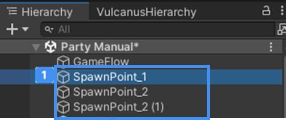

# 스폰포인트 장치

Stage 게임이 동작하는데 필수 요소인 플레이어의 아바타를 생성시켜주는 시스템 장치입니다.
게임이 시작되면 스폰포인트 장치에 자동으로 아바타가 생성됩니다.

## 주요 특징

 {width="400"}

Hierarchy에서 컨텍스트 메뉴로 생성하고 사용할 수 있습니다.
>팔레트에서 제공하지 않습니다.

  {width="400"}

Hierarchy에서 컨텍스트 메뉴를 통해 여러 개를 생성할 수 있습니다.  
템플릿에서 제공하는 Stage Scene에는 기본적으로 스폰포인트 장치가 배치 및 설정되어 있습니다.

## 옵션

 {width="400"}

 'Use Spawn Point'는 기본으로 체크되어 있습니다.  
만약, 스폰포인트를 리스폰 포인트로 사용하려면 체크를 해제하고,
리스폰 기능이 있는 장치에 리스폰 포인트로 사용하려는 스폰 장치를 연결해 사용할 수 있습니다.   
자세한 내용은 **참고**의 **사망 존 장치**를 참고하세요! 

### 원하는 위치에 아바타 스폰하기
스폰포인트 장치를 설치하고, Scene에 위치를 수정해 보세요.  
- 게임 참가 인원수와 동일한 개수로 스폰포인트 장치를 설치하면, 원하는 위치에 아바타를 배분하기 좋습니다.  
- 게임 참가 인원수가 스폰포인트 장치 개수 보다 많으면, 배분 로직에 따라 아바타를 자동 배분해 스폰합니다.  

## 참고  

- [사망 존 장치](Contents-Death-Zone-Device.md)