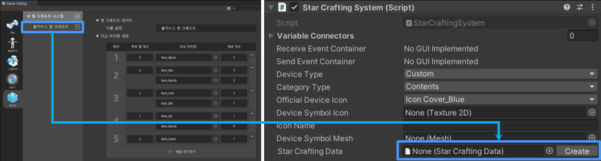
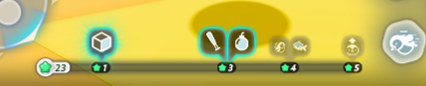

# 별 크래프트 시스템 장치

이름: SD_StarCraftingSystem

{width="400"}
Stage에서 별 크래프트 시스템을 사용할 경우, Scene에 배치하여 사용하는 시스템 장치입니다.  
게임이 시작되면, StarCraftingSystem 장치에 연결된 별 크래프트 데이터와 UI가 게임에 표시됩니다.

## 옵션

{width="900"}

| **이름**              | **설명**                                                          |
|:--------------------|:----------------------------------------------------------------|
| Star Crafting Data  | 사용할 별 크래프트 데이터를 연결합니다. 데이터가 연결되면, 게임 시작 시 별 크래프트 UI가 게임에 출력됩니다. |

{width="400"}

| **이름**     | **설명**                                         |
|:-----------|:-----------------------------------------------|
| 별 크래프트 UI  | Scene에 설치된 별 크래프트 장치에 데이터를 연결하였을 때 표시되는 UI입니다. |

## Tip
별 크래프트 시스템을 다양하게 사용하기
- 별 크래프트 시스템은 스테이지마다 다르게 설정할 수 있습니다.
- 별 크래프트 데이터를 여러개 제작하고, 스테이지마다 데이터 연결을 다르게 세팅하여 스테이지만의 특색을 제작할 수 있습니다.
- 유저가 획득할 별을 스폰하기 위해서는 별 크래프트 스폰 장치를 Scene에 배치해야 합니다.

## 참고

[별 크래프트 스폰 장치](Contents-Starcraft-Spawner-Device.md)
