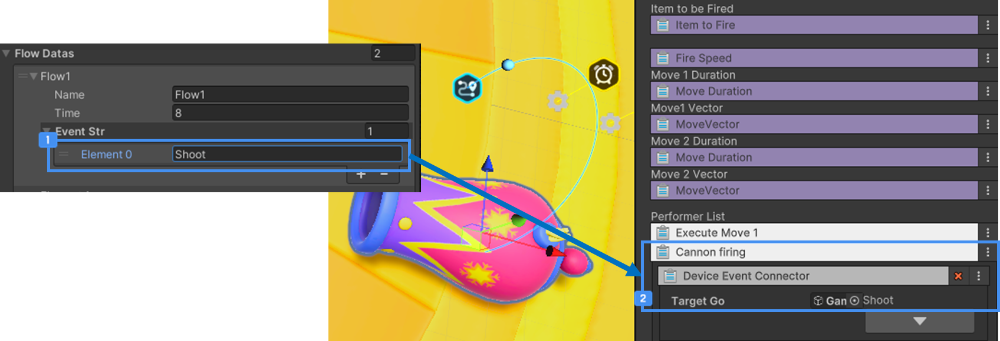

# 게임플로우 장치

 {width="400"}

Stage 게임의 동작 흐름을 관리하는 시스템 장치입니다.  
게임의 시작과 플레이, 종료를 쉽게 관리할 수 있습니다.  

Scene에는 1개의 GameFlow 장치만 배치할 수 있습니다.  
템플릿에서 제공하는 Stage Scene에는 기본적으로 GameFlow 장치가 배치 및 설정되어 있습니다.

 {width="400"}

Hierarchy에서 컨텐스트 메뉴로 생성하고 사용할 수 있습니다.
>GameFlow장치는 팔레트에서 제공하지 않습니다.  

## 옵션

 {width="400"}

- Stage 게임의 Flow 1개를 설정합니다.
- Flow의 이름을 입력할 수 있습니다.
- 해당 Flow의 진행 시간을 설정합니다. 설정한 시간이 지나면 자동으로 Flow가 종료되며, 다음 Flow가 실행됩니다.
  - 만약, 마지막 Flow였다면 Stage 게임이 종료됩니다.
  - 시간을 0을 설정할 경우, 해당 Flow는 종료되지 않습니다. Flow를 종료하기 위해서는 다른 장치로 부터 Flow종료 Event를 받아 종료할 수 있습니다.
- '+' 또는 '-' 버튼을 클릭해 Event Message를 추가하거나 삭제할 수 있습니다.
- Flow를 추가하거나 삭제하려면 Flow Datas 맨 하단의 '+', '-' 버튼을 클릭합니다.  

### **Flow종료 장치**로 Flow종료하는 방법

 {width="900"}

 **Flow종료 장치**로 종료할 
종료시킬 Flow 이름을 입력하면, 게임 플레이 시 해당 장치가 작동할 때 입력된 이름의 Flow를 종료합니다.  
 **Flow종료 장치**는 다른 장치의 Event를 받으면 작동합니다.  

자세한 내용은 **참고**의 **장치 간 이벤트 연결하기**와 **게임 종료 장치**를 참고하세요! 
  
  
### Flow의 Event Message를 받아 장치 동작하는 방법 예시

 {width="900"}

 창작자가 Flow에 대포 발사에 사용 할 Event를 작성합니다. (예시에서는 'Shoot'으로 작성)  

 대포 장치에 대포 발사를 위한 트리거에 **GameFlow 장치**를 연결하고, Event 선택 버튼({width="50"})을 클릭해 **Shoot** Event를 선택합니다.  
이렇게 설정하면 게임 플레이 시 해당 Flow가 시작되면, 대포 장치는 Event를 받아 대포에 장착된 발사체를 발사합니다.

## 편의 기능

### Current Flow 확인 

해당 기능은 게임 플레이 시 현재 진행되는 Flow를 표기해 주기 위한 개발 편의 기능입니다.  
즉, 편집 단계에서는 아무 기능도 하지 않습니다. UIUX 개선 시 보다 직관적인 방향으로 변경될 예정입니다.
 {width="900"}

### Flow 순서 변경

 {width="900"}

마우스로 클릭 후 원하는 순서에 드래그해 놓으면 순서가 변경됩니다.

### Flow 복사 및 붙여넣기  

 {width="900"}

 Flow화면에서 마우스 우클릭 후 'Copy'를 합니다.  
 붙여넣을 Flow를 선택 후 마우스 우클릭 후 'Paste'를 합니다. 

### 전체 Flow Component 값 복사 및 붙여넣기

 {width="400"}

 Flow Component 메뉴에서 'Copy Component' 를 클릭합니다.  
 붙여넣을 다른 Stage의 Scene에 있는 Flow Component 메뉴에서 'Paste Component Values' 를 클릭합니다.  

## 참고
- [장치 간 이벤트 연결하기](Connect-Event-Between-Devices.md)
- [게임 종료 장치](Contents-Game-End-Device.md)  
- [대포 발사 장치](Gimmcks-Cannon-Device.md)