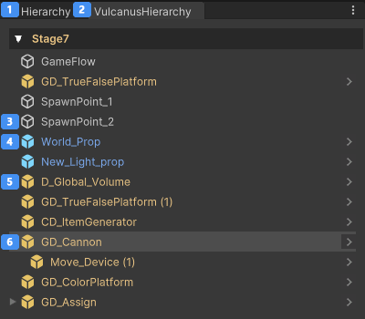
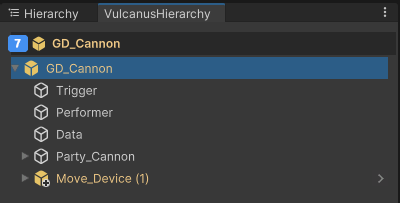

# 불카누스 하이어라키

불카누스는 장치사용을 기반으로 하는 사용환경과 프리펩 편집 환경을 기반으로 하는 편집환경이 존재합니다.  
쉬운 장치 사용성을 지원하기 위해 모드에 따라 하이어라키의 표시 상태가 달라지며 이를 효과적으로 제어하기 위해 최적화된 불카누스 하이어라키를 제공합니다.  
현재의 하이어라키는 기본형으로 이후 더 많은 기능이 추가 예정에 있습니다.  

## 하이어라키 특징

불카누스 하이어라키의 특징은 아래와 같습니다. 

- 불카누스 하이어라키에서는 불카누스 오브젝트만 표시됩니다. 불카누스 오브젝트는 장치와 프랍, 그 밖에 카메라 같이 불카누스에서 제작한 특수한 오브젝트가 있습니다.
- 불카누스 오브젝트는 성격에 따라 지정된 아이콤으로 표시됩니다.

## UI 기능 상세 설명  

 

| 이미지                                                                        | 설명                                                                                              |
|:---------------------------------------------------------------------------|:------------------------------------------------------------------------------------------------|
|  Unity 오리지널 하이어라키     | Vulcanus 하이어라키가 완성되기 전까지 디폴트 레이아웃은 두 개의 하이어라키를 도킹하여 같이 제공합니다.                                   |
|  Vulcanus 하이어라키       | Vulcanus 의 사용성에 맞게 새로 개발 중인 하이어라키 입니다.                                                          |
| 프리펩이 아닌 Vulcanus 오브젝트 | 시스템 장치가 이에 해당합니다.                                                                               |
| 장치가 아닌 일반 프리펩         | Prop 프리펩이 해당합니다. 모든 Prop은 프리펩 입니다.                                                              |
| Vulcanus 장치 프리펩       | 시스템을 제외한 모든 장치가 이에 해당합니다. 모든 장치는 프리펩 입니다.                                                       |
| 씬 사용성에서의 장치           | 씬에서 장치를 선택하면 장치의 차일드 중 장치와 프랍에 해당하는 오브젝트만 노출됩니다.                                                |
| 프리펩 편집모드 상태에서의 장치     | 프리펩 편집 상태와 의 차일드 오브젝트를 비교해보면 차이를 알 수 있습니다. |