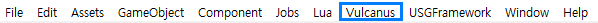

# 불카누스 메뉴 구성

불카누스는 고유한 사용환경과 사용성을 가지고 있습니다. 이에 따라 추가되었거나 사용이 권장되지 않는 메뉴가 있습니다. 

## 불카누스 추가 메뉴
불카누스에서 추가한 메뉴는 탑바의 Vulcanu 하위에 위치합니다.
1. FixUp
   - 기존 프로젝트의 리소스 호환이 손상된 부분을 복구해 주는 메뉴
2. 윈도우 출력
   - 불카누스 팔레트
   - 불카누스 하이어라키
   - 게임 설정
2. 불카누스 레이아웃 
   - Reload Layout

## 사용을 권장하지 않는 메뉴
- 프리펩 편집 모드가 아닌상태에서 Game Object 를 통하여 하이어라키에 Unity Object 를 생성하지 않도록 주의하세요.  
  (장치 사용 환경에서는 Vulcanus 오브젝트만을 허용합니다. Vulcanus 하이어라키에는 해당 내용이 보여지지 않습니다.)

## 참고