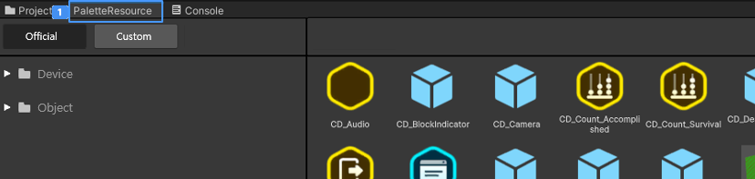
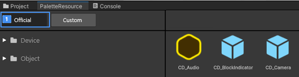
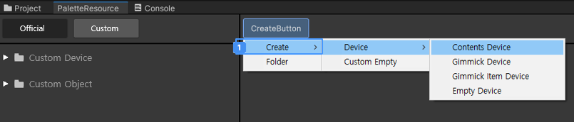
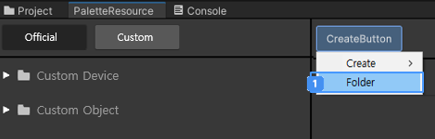

# 불카누스 팔레트

장치를 쉽게 찾아 사용할 수 있도록 만든 에디터 창 형태의 리소스 브라우저 입니다.  
팔레트에는 다양한 기능의 장치 뿐만 아니라, 배경을 꾸미거나 장치의 외형을 만드는데 사용할 수 있는 기본 오브젝트도 포함되어 있습니다.  

 {width="900"}

## 장치와 기본 오브젝트 차이  

장치와 기본 오브젝트는 모두 Scene에 배치해 사용할 수 있지만, 장치에만 비주얼 스크립트 사용 및 Scene에서의 동기화 기능이 제공됩니다.  
즉, 기본 오브젝트는 단순 배경 꾸미기 용도나 장치 하위에 넣어 외형을 꾸미는 용도로 사용하길 권장합니다. 

## 팔레트 주요 기능

### 공식 장치 및 기본 오브젝트 전시와 사용

팔레트의 UI 레이아웃은 아래와 같이 2개의 컬럼으로 구성됩니다.

 {width="900"}

### 공식 제공되는 장치 카테고리

| 구분        | 내용                                                             |
|-----------|----------------------------------------------------------------|
| 시스템 장치    | 시스템과 연관된 장치로 제공된 특별한 기능은 창작자가 편집할 수 없지만 다른 장치와 연결해 사용할 수 있습니다. |
| 컨텐츠 장치    | 시스템 장치, 기믹 장치와 연결하여 컨텐츠를 풍부하게 만들어 줄 수 있는 장치입니다.                |
| 기믹 장치     | 대포, 발판, 장애물 등 아바타와 상호작용하며 물리적, 외형적으로 보여지는 기능을 갖는 장치입니다.        |
| 기믹 아이템 장치 | Scene에 직접 배치하거나 장치에 연결해 사용할 수 있는 아이템 형태의 장치입니다.                |
| 장착 아이템 장치 | 아바타에 장착할 수 있는 아이템 장치입니다.                                       |
| 버프 장치     | 아바타에 버프를 부여할 수 있는 버프 설정 장치입니다.                                 |

### 공식 제공되는 기본 오브젝트 카테고리

| 구분      | 내용                                                                                                |
|---------|---------------------------------------------------------------------------------------------------|
| 기본 도형   | 단순한 도형 모양의 장치로 모델의 텍스처 정도를 편집할 수 있는 제한된 기능만 제공되는 오브젝트입니다.                                         |
| 배경 오브젝트 | 기능이 존재하지 않는 단순한 게임 배경 꾸미기 오브젝트입니다.                                                                |

## 팔레트에서의 장치 사용법

 {width="900"}

 팔레트에 전시된 장치를 마우스로 클릭을 합니다.  
 드래그해 Scene의 원하는 위치에 드롭하여 배치해 사용하거나, Hierarchy에 드롭해 사용할 수 있습니다.  
> 기본적으로 Unity의 Prefab 사용 방식과 동일합니다.

### 커스텀 장치 및 오브젝트 생성

 {width="900"}

커스텀 Tab을 선택하면 Create 버튼이 나오며, 컨텐스트 메뉴에서 생성할 장치 메뉴를 클릭하면 장치가 생성됩니다.  
- 생성된 장치는 '커스텀 장치' 폴더에서 확인 및 사용할 수 있습니다.  

#### 장치 폴더 관리

새 폴더를 만들어 만든 장치들을 관리하면 작업 효율을 높일 수 있습니다.  

 {width="900"}

컨텐스트 메뉴에서 폴더 메뉴를 클릭하면 새 폴더가 생성됩니다.  
커스텀 장치의 사용은 공식 장치와 동일합니다. 간단히 드래그&드랍으로 Scene 또는 Hierarchy에 배치하면 됩니다.