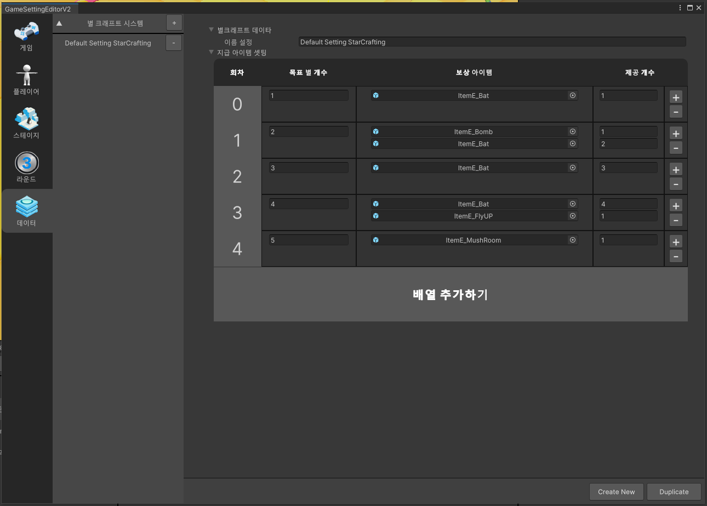
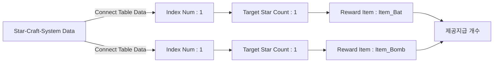

# 게임 데이터

{width="900"}

게임 데이터는 게임에서 다양하게 사용하기 위한 데이터를 설정하는 공간입니다.
게임 데이터에서는 별 크래프트 데이터를 사용할 수 있습니다.  

## 별 크래프트 시스템 데이터

별 크래프트 데이터는 '아이템을 구매에 소비할 별 개수', '지급 아이템', '지급 개수'를 설정할 수 있습니다.  
완성된 데이터는 스테이지에서 '별 크래프트 시스템 장치'와 '별 크래프트 스폰 장치'를 이용하여 게임 내에 구성할 수 있습니다.

## 별 크래프트 테이블 구조

## 옵션

| **이름**               | **내용**                                      | 
|----------------------|---------------------------------------------|
| 별 크래프트 시스템 Data List | 별 크래프트 데이터를 추가하거나 제거할 수 있습니다                |
|                      | - '+'버튼을 이용하여 별 크래프트 데이터를 추가할 수 있습니다.       |
|                      | - '-'버튼을 이용하여 제작한 별 크래프트 데이터를 제거할 수 있습니다.   |
| 이름 설정                     | 별 크래프트 데이터의 이름을 설정합니다.                      |
|                      | - 입력한 이름은 별 크래프트 데이터 파일명으로 저장됩니다.           |
| 목표 별 개수                     | 보상 아이템에 필요한 별 아이템 개수를 설정합니다.                |
| 보상 아이템                    | 구매 시 지급할 아이템을 설정합니다.                        |
|                           | - 보상으로 지급할 아이템은 '장착 아이템 장치'를 등록하여 사용해야 합니다. |
|                           | - '+'버튼을 이용하여 지급할 아이템의 선택지를 만들 수 있습니다                                            |
|                           | - '-'버튼을 이용하여 설정한 아이템을 제공할 수 있습니다.                                            |
| 제공 개수                          | 구매 시 지급할 아이템을 설정합니다.                                            |
|                           | - '+'버튼을 이용하여 지급할 아이템의 선택지를 만들 수 있습니다                                            |
|                           | - '-'버튼을 이용하여 설정한 아이템을 제공할 수 있습니다.                                            |
| 배열 추가하기                         | 배열을 추가하여 지급할 아이템 리스트를 추가할 수 있습니다.                                            |

## 제작한 별 크래프트 연동하기
1. 별 크래프트를 게임 내에서 사용하기 위해서는 별 크래프트 장치와 장착 아이템 장치가 필요합니다.
2. Game Data "Bonus Item"의 프로퍼티를 클릭하면, 리소스 선택 팝업이 출력됩니다.
3. 리소스 선택 팝업에는 모든 게임 오브젝트가 출력됩니다

## 참고

- [별 크래프트 시스템 장치](Starcraft-System-Device.md)
- [별 크래프트 스폰 장치](Contents-Starcraft-Spawner-Device.md)
- [장착 아이템 장치](Equipitem-Item-System.md)