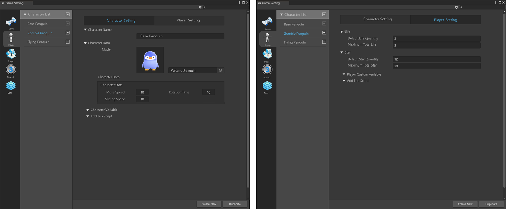

# 플레이어 및 캐릭터 설정

{width="900"}

플레이어 및 캐릭터 설정은 게임을 하는 유저와 유저가 하는 캐릭터를 설정하는 공간입니다.  
2개의 탭으로 구성되어 있으며, 각각 '플레이어 설정'과 '캐릭터 설정'으로 구분됩니다.

## 플레이어 설명

플레이어는 게임을 플레이 하는 유저를 말합니다.  
플레이어 설정이란? 게임을 하는 유저에게 필요한 정보를 추가 및 저장하여 게임 내에서 사용할 수 있습니다.

### 플레이어 설정 옵션

| **이름**            | **내용**                                                    | 
|-------------------|-----------------------------------------------------------|
| Life              | 플레이어의 기본 Heart를 설정할 수 있습니다                                |
|                   | - Default Life Quantity: 게임 시작 시 기본으로 제공되는 라이프 개수를 설정합니다. |
|                   | - Maximum Total Life: 플레이어가 최대로 가질 수 있는 라이프 개수를 설정합니다.    |
| Star              | 라운드 시작 시 별을 설정할 수 있습니다                                    |
|                   | - Default Star Quantity: 게임 시작 시 기본으로 제공되는 별 개수를 설정합니다.   |
|                   | - Maximum Total Star: 플레이어가 최대로 가질 수 있는 별 개수를 설정합니다       |
| Player Joiner     | 플레이어 추가 모집 설정                                             |
|                   | - 허용 / 허용안함 설정 값을 이용하여 대기룸에서 플레이어를 추가로 모집합니다.             |
|                   | - 플레이어를 추가로 모집할 경우 지정된 시간 동안 최대 인원 수만큼 플레이어를 모집합니다        |
| Player Custom Varible | 플레이어 커스텀 변수 설정                                                          |
|                   | - 플레이어가 사용할 커스텀 변수를 설정할 수 있습니다.                                                          |
|                   | - 변수 Key 값을 설정하고, 게임 내 장치를 통해 커스텀 변수를 Visual Script를 통해 플레이어 변수를 제작할 수 있습니다.                                                          |
| Add Lua Script    |   루아 스크립트를 적용할 수 있습니다. |
 

## 캐릭터 설명

캐릭터는 유저가 게임을 진행할 때 게임에서 사용하며, 플레이어를 대변하는 객체(아바타)입니다.  
캐릭터 설정은 플레이어가 사용하는 아바타에 필요한 정보를 추가 및 저장하여 게임 내에서 사용할 수 있습니다

### 캐릭터 설정 옵션

| **이벤트 이름**         | **내용**                                                         | 
|--------------------|----------------------------------------------------------------|
| Character List     | 플레이어가 사용할 수 있는 캐릭터들을 의미합니다.                                    |
|                    | - 창작자는 캐릭터 리스트에 등록한 캐릭터를 SpawnPoint 장치를 이용하여 게임에 등장 시킬 수 있습니다. |
| Character Name     | 캐릭터의 이름을 설정할 수 있습니다.                                           |
| Model              | 사용할 캐릭터의 모델을 설정합니다.                                            |
| Character Stats    | 캐릭터 스탯을 설정합니다                                                  |
|                    | - Move Speed: 캐릭터의 이동속도를 설정합니다                                 |
|                    | - Rotation Time: 캐릭터의 회전 속도를 설정합니다.                            |
|                    | - Sliding Speed: 캐릭터의 미끄러지는 속도를 설정합니다                          |
| Character Variable | 캐릭터 변수 설정                                                      |
|                    | - 캐릭터에서 사용할 변수를 설정할 수 있습니다.                                    |
|                    | - 변수 Key 값을 설정하고, 게임 내 장치를 통해 커스텀 변수를 Visual Script를 통해 캐릭터 변수를 제작할 수 있습니다.                                                               |
| Add Lua Script     | 루아 스크립트를 적용할 수 있습니다.                                                               |
