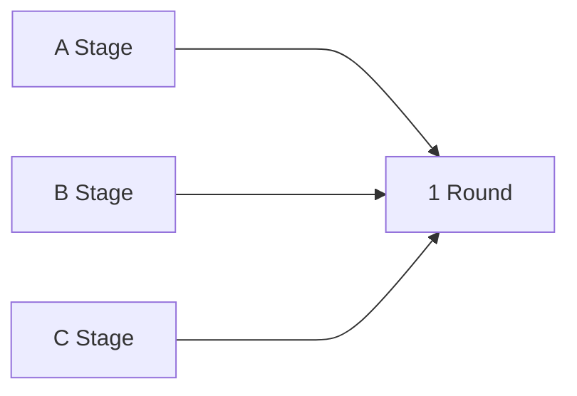

# 라운드 설정

{width="900"}

라운드 설정은 게임 진행의 순서를 설정하고, 라운드가 진행될 때 사용할 스테이지를 등록하는 공간입니다.  
라운드 설정에서 사용자는 진행할 라운드를 설정할 수 있고, 라운드에서 사용할 스테이지를 등록할 수 있습니다.

## 라운드와 스테이지의 관계

1. 1개의 라운드에는 복수의 스테이지를 등록할 수 있습니다.
2. 게임이 시작되면, 라운드는 1라운드부터 실행됩니다.
3. 라운드에 스테이지가 복수로 등록되어 있다면 해당 라운드는 랜덤하게 스테이지가 선택되어 게임을 진행합니다.

## 라운드 설정

게임을 진행할 라운드를 편집하고, 라운드 내에 스테이지를 등록할 수 있습니다.

### 옵션

| **이름**            | **내용**                                                    | 
|-----------------------|-----------------------------------------------------------|
| Round                 | 진행되는 라운드 순서를 말합니다.                               |
|                       | - 라운드에 스테이지를 등록할 수 있습니다. |
| Configure Stage | 선택한 라운드에 스테이지를 등록할 수 있습니다.                                    |
|                       | - 버튼을 클릭하면, Stage List 팝업이 열리며, 원하는 스테이지를 등록할 수 있습니다. |
| Create New                      | 라운드를 추가합니다. |
|                       | - Default Star Quantity : 게임 시작 시 기본으로 제공되는 별 개수를 설정합니다. |
|                       | - Maximum Total Star : 플레이어가 최대로 가질 수 있는 별 개수를 설정합니다. |

## Stage List

1. 게임사에서 제공한 스테이지(템플릿)과 사용자가 제작한 스테이지 리스트가 표시됩니다.
2. 사용자는 라운드에 스테이지를 등록하거나, 편집 버튼을 통해 선택한 스테이지의 데이터를 편집할 수 있습니다.
3. 스테이지 편집 방식은 ['스테이지 설정'](GameSettings-Stage.md)을 참고하세요.