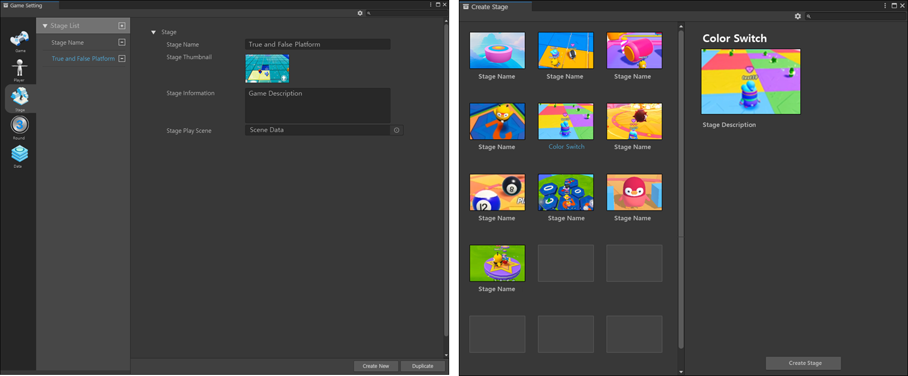

# 스테이지 설정

{width="900"}

스테이지는 '게임을 진행하는 공간'을 말합니다.  
라운드가 실행되면 라운드에 구성된 1개의 스테이지가 실행되며, 각 스테이지는 1개의 Scene으로 제작되어 있습니다.  

## 옵션

| **이름**         | **내용**                                              | 
|----------------|-----------------------------------------------------|
| Stage List     | 창작자가 커스텀으로 제작한 스테이지 리스트입니다.                         |
|                | 제작한 스테이지는 라운드에 등록하여, 사용할 수 있습니다.                    |
| Stage Name     | 스테이지의 이름을 설정합니다.                                    |
| Stage Thumbnail | 스테이지의 대표 이미지를 설정합니다.                                |
|                | 설정한 스테이지 Thumbnail은 라운드 슬롯에 표시됩니다.                  |
| Stage Information | 스테이지의 안내 문구를 표시합니다.                                 |
| Stage Play Scene | 테이지에서 사용할 Scene을 등록할 수 있습니다.                        |
| Create New     | 새로운 스테이지를 만들 수 있으며, 버튼을 클릭하면 스테이지 제작을 위한 팝업이 출력됩니다. |

## 스테이지 만들기 팝업

1. 스테이지 만들기 팝업이 열리면, 창작자는 빈 템플릿 혹은 개발사에서 제공한 템플릿을 확인할 수 있습니다. 
2. 창작자는 공식으로 제공한 템플릿을 커스텀 스테이지로 복제하여 사용하거나, 빈 템플릿을 선택하여 스테이지를 설정할 수 있습니다.
3. 빈 템플릿을 이용하여 처음부터 스테이지를 제작하거나, 공식으로 제공한 템플릿을 이용하여 일부만 편집하여 스테이지를 편집할 수 있습니다.
4. 공식 템플릿을 사용할 경우 공식 템플릿에 내장된 리소스와 Scene을 이용할 수 있습니다. 