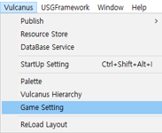
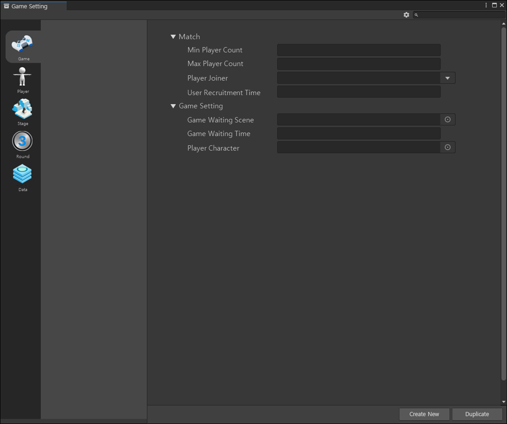

# 게임 설정

게임 설정은 불카누스 에디터에 진입한 사용자가 인게임 밖에서 우선 세팅해야 하는 데이터를 설정할 수 있는 공간입니다.  
게임 설정에 있는 기능을 이용하여 **게임의 기본 설정, 플레이어 및 캐릭터, 라운드, 스테이지, 데이터**에 대한 내용을 설정할 수 있습니다.   

## 게임 설정 열기

{width="200"}

경로 : Vulcanus Menu > Game Setting

## 게임 설정하기

{width="900"}

게임 설정은 크게 2개의 항목으로 구성되며, 다음과 같습니다.

### Match

1. **Min Player Count:** 최소 인원 설정
   - 게임에 진입할 수 있는 최소 인원을 설정합니다.
   - 최소 인원이 매칭이 되면 게임에 진입합니다.
2. **Max Player count:** 최대 인원 설정
    - 게임에 진입할 수 있는 최대 인원을 설정합니다.
3. **Player Joiner:** 플레이어 추가 모집 설정
    - 허용 / 허용안함 설정 값을 이용하여 대기룸에서 플레이어를 추가로 모집합니다.
    - 플레이어를 추가로 모집할 경우 지정된 시간 동안 최대 인원 수만큼 플레이어를 모집 합니다 
4. **User Recruitment Time:** 추가 모집 시간
    - Player Joiner를 설정했을 경우 플레이어를 모집하는 시간을 설정합니다.
    - 설정된 시간이 종료되면 플레이어 모집을 중지합니다.

### Game Setting
1. **Game Waiting Scene:** 대기룸 설정
   - 게임에 진입 했을 시 대기룸으로 사용할 Scene을 설정합니다.
   - 대기룸에 있는 동안 플레이어를 추가로 모집할 수 있습니다.
2. **Game Waiting Time:** 대기룸 대기 시간
   - 대기룸에서 플레이어들이 대기하는 시간을 설정합니다.
   - 설정한 시간이 종료되면, 게임 라운드에 진입합니다.
3. **Player Character:** 기본 캐릭터 설정
   - 게임에서 사용할 기본 캐릭터를 설정합니다.
   - 게임 내에서 사용할 캐릭터를 재정의하지 않을 경우 게임 설정에 설정한 캐릭터가 등장합니다.

## 게임 설정 항목

<toc/>