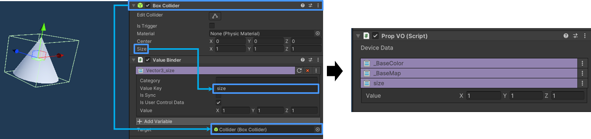
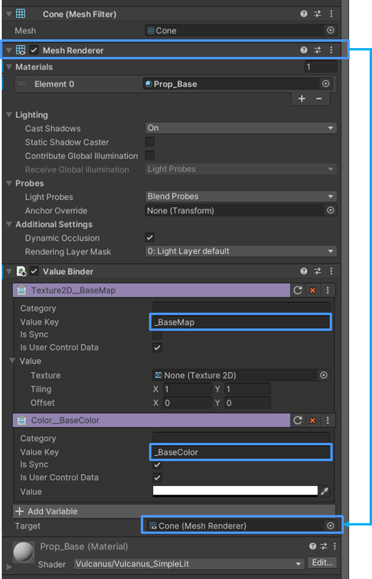

# Value Binder

Unity Component를 Vulcanus Object에 바인딩하여 Inspector에 표시합니다.

## 컴퍼넌트 타입

Value Binder에서 사용하는 변수 타입은 Variable에서 설정할 수 있는 항목과 모두 동일합니다.
변수 설정에 대한 내용은 Variable 항목을 참고하세요

## Value Binder 사용하기
1. Value Binder를 설정하기 위해서는 Visual Script 편집 화면에서 작성해야 합니다.
2. 연결하고자 하는 Component와 Value Binder Compoent가 동일한 Inspector에 있어야 합니다.
3. Value Binder에는 바인딩할 타입의 값과 동일하게 세팅되어야 합니다. (가져올 값이 Vector3라면 Value 값 또한 Vector3로 설정해야 합니다)
   {width="900"}
   - 사용 방식
     - 연결할 Unity Compoent를 "Value Binder > Target"에 등록합니다. (예시 : Box Collider를 등록)
     - Value Key에 사용할 항목의 key를 동일하게 적용합니다 (예시 : Box Collder)
     - 바인딩한 결과는 Scene Inspector에 표시되며, Scene에서 인스턴스 데이터로 값을 수정할 수 있습니다.

## Shader 연결하기
1. Value Binder를 이용하여, Material의 Color나 Texture를 변경할 수 있습니다.
2. Inspector에 "Meshrender component"가 있어야 하며, 같은 Component에 "Value Binder"를 연결합니다.
    {width="400"}
   - 사용 방식
     - 색상을 바꾸기 위해서는 Value Binder를 Color Type으로 설정합니다.
     - Texture로 변경하기 위해서는 Texture 2D 타입으로 설정합니다.
     - Value Key에 컬러는 "_BaseColor"을 설정하고, Texture는 "_BaseMap"으로 설정합니다.
     - Material 색상이나 텍스쳐를 변경하기 위해서는 key값 앞에 "_"를 추가해야 합니다.

## 참고
- [Variable 사용 가이드](Setting-variable.md)
- [Variable](Variable.md)
- [새 프랍 만들기](How-to-Create-Custom-Prop.md)