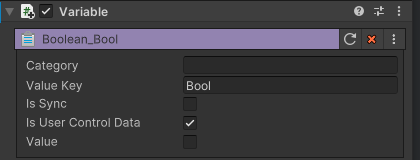

# Variable

변수는 설정 된 값을 동적으로 변경하거나, 게임 플레이 진행 중에 추적할 수 잇는 데이터 저장소 입니다.  
변수는 장치 Insepctor에 표시할 수 있으며, 표시된 Inspector는 Scene에서 간단하게 변경할 수 있습니다.

## Parameter
{width="400"}

Varible - boolean 예시

| **이름**               | **설명**                                       |
|----------------------|----------------------------------------------|
| Category             | 장치의 Scene Inspector에 옵션으로 구성할 카테고리 문구를 작성합니다. |
| Value key            | Variable의 키 값을 설정합니다.                        |
| Is Sync              | 서버와 데이터 동기화가 필요한 경우에 사용합니다                   |
| Is User Control Data | 장치의 Scene Inspector 표시 여부를 설정합니다             |
| Value                | 데이터 값을 설정합니다.                              |

## Tip
1. 변수는 장치를 구성하는데 다양하게 사용하고 있으며, 제작된 장치는 Variable 데이터가 포함되어 있습니다.
2. 공식 장치를 통해 제작된 Variable 데이터를 참고하세요
3. Is User Control Data를 체크하여, Scene Inspector에 장치의 옵션을 표시할 수 있습니다.
4. 장치를 사용하는 다른 사용자는 옵션 값만 변경하여 장치의 기능을 사용할 수 있습니다.
5. 자세한 변수 리스트는 하단 리스트를 참고하세요

## 참고
<toc/>