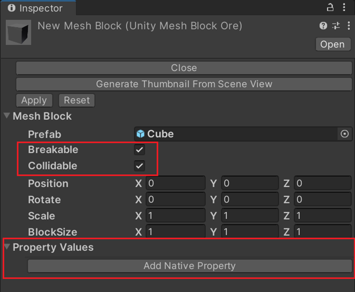
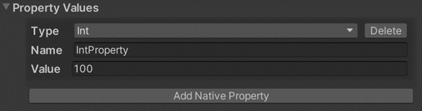
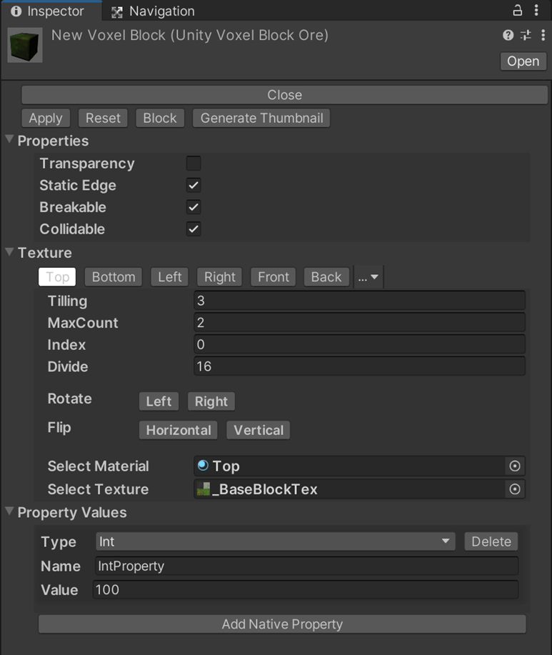

# Block Property

## Mesh Block



| API Function Name    | Functional Description              |
|----------------------|-------------------------------------|
| IsBreakable          | Breakable 의 값 획득(읽기 전용)             |
| IsCollider           | Collidable 의 값 획득(읽기 전용)            |
| UnityVoxelProperties | 자체 정의한 Property Value 의 값 획득(읽기 전용) |

참고: 이러한 프로퍼티는 Editor 에서만 편집할 수 있으며 lua 코드는 프로퍼티 값만 획득할 수 있고 설정할 수 없습니다.

## Lua 사용법

### IsBreakable

Breakable 의 값 획득(읽기 전용)
Breakable 이 false 인 경우, 해당 Block 에 대해 DeleteBlock 관련 API 를 호출해도 해당
Block 은 없어지지 않습니다.

### Use case
마우스로 복셀을 클릭하여 Breakable 의 값을 출력합니다.


### Scripting

```Lua
local TerrainServiceUtility = USGFramework.Runtime.USGVoxelTerrain.ServiceFunctions.TerrainServiceUtility
local Input = UnityEngine.Input
 
function this.Update()
    if Input.GetMouseButtonDown(0) then
        local camera = UnityEngine.Camera.main
        local ray  = camera:ScreenPointToRay(Input.mousePosition)
        local flag, hit = UnityEngine.Physics.Raycast(ray, nil, 5000)
         
        if flag then
                local pos = hit.point
                this.GetVoxelByPosition(pos)
        end
    end
end
 
function this.GetVoxelByPosition(position)
    local blockInfos = TerrainServiceUtility.GetBlockAssetByPositions(position)
    local center = blockInfos[0].Key
    local blockAsset = blockInfos[0].Value
    print(blockAsset.IsBreakable)
end
```


### IsCollider

Collidable 의 값 획득(읽기 전용)


### Scripting
```Lua
local TerrainServiceUtility = USGFramework.Runtime.USGVoxelTerrain.ServiceFunctions.TerrainServiceUtility
local Input = UnityEngine.Input

function this.Update()
    if Input.GetMouseButtonDown(0) then
        local camera = UnityEngine.Camera.main
        local ray  = camera:ScreenPointToRay(Input.mousePosition)
        local flag, hit = UnityEngine.Physics.Raycast(ray, nil, 5000)
	
	    if flag then
            local pos = hit.point
            this.GetVoxelByPosition(pos)
		end
	end
end

function this.GetVoxelByPosition(position)
    local blockInfos = TerrainServiceUtility.GetBlockAssetByPositions(position)
    local center = blockInfos[0].Key
    local blockAsset = blockInfos[0].Value
    print(blockAsset.IsCollider)
end
```

### UnityVoxelProperties
자체 정의한 Property Value의 값 획득(읽기 전용)



### Scripting
```Lua
local TerrainServiceUtility = USGFramework.Runtime.USGVoxelTerrain.ServiceFunctions.TerrainServiceUtility
local Input = UnityEngine.Input

function this.Update()
    if Input.GetMouseButtonDown(0) then
        
        local camera = UnityEngine.Camera.main
        local ray  = camera:ScreenPointToRay(Input.mousePosition)
        local flag, hit = UnityEngine.Physics.Raycast(ray, nil, 5000)
        
        if flag then
            local pos = hit.point
            this.GetVoxelByPosition(pos)
        end
    end
end

function this.GetVoxelByPosition(position)
    local blockInfos = TerrainServiceUtility.GetBlockAssetByPositions(position)
    local center = blockInfos[0].Key
    local blockAsset = blockInfos[0].Value
    print(blockAsset.UnityVoxelProperties[0].Value)
end
```

## VoxelBlock
VoxelBlock 은 터레인 내 복셀을 통칭하는 것이며 Transparency, Static Edge, Breakable, Collider, Property Values 프로퍼티를 포함합니다.

| API Function Name      | Functional Description                                                                          |
|------------------------|-------------------------------------------------------------------------------------------------|
| IsTransparentBlockType | VoxelBlock 과 Transparency 가 false 인 VoxelBlock 사이의 텍스처를 렌더링할지 여부(읽기 전용))                        |
| NoStaticEdge           | VoxelBlock 에 명확한 경계가 있는지 여부(읽기 전용)                                                              |
| IsBreakable            | 이 VoxelBlock 를 파괴할 수 있는지 여부(읽기 전용)                                                              |
| IsCollidable           | 이 VoxelBlock 이 충돌할 수 있는지 여부(읽기 전용)                                                              |
| UnityVoxelProperties   | 자체 정의 프로퍼티이며, 해당 VoxelBlock 에 int, float, string, bool, Vector2, Vector3 프로퍼티를 추가할 수 있음 (읽기 전용) |
참고: 이 프로퍼티는 에디터 내에서만 편집할 수 있습니다. Lua 코드는 속성 값만 가져올 수 있지만 설정할 수는 없습니다.

### IsTransparentBlockType
VoxelBloc 과 Transparency 가 false 인 VoxelBlock 사이의 텍스처를 렌더링할지 여부(읽기전용)
보통 투명한 Block 이나 충돌하지 않는 Block 에서 열립니다.

### NoStaticEdge
Block 사이에 명확한 경계가 있는지 여부

### IsBreakable
이 Block 을 파괴할 수 있는지 여부
Breakable 이 false 인 경우, 해당 Block 에 대해 DeleteBlock 관련 API 를 호출해도 해당Block 은 없어지지 않습니다

```Lua
local TerrainServiceUtility = USGFramework.Runtime.USGVoxelTerrain.ServiceFunctions.TerrainServiceUtility
local Input = UnityEngine.Input
 
function this.Update()
    if Input.GetMouseButtonDown(0) then
        local camera = UnityEngine.Camera.main
        local ray  = camera:ScreenPointToRay(Input.mousePosition)
        local flag, hit = UnityEngine.Physics.Raycast(ray, nil, 5000)
         
        if flag then
            local pos = hit.point
            this.GetVoxelByPosition(pos)
        end
    end
end
 
function this.GetVoxelByPosition(position)
    local blockInfos = TerrainServiceUtility.GetBlockAssetByPositions(position)
    local center = blockInfos[0].Key
    local blockAsset = blockInfos[0].Value
    print(blockAsset.IsBreakable)
end
```
### Collider
이 Block 이 충돌할 수 있는지 여부

### Property Values
자체 정의 프로퍼티이며, 해당 VoxelBlock 에 int, float, string, bool, Vector2, Vector3
프로퍼티를 추가할 수 있습니다.
활용 사례: 마우스로 복셀을 클릭하여 Property Values 에서 해당 인덱스 값을 출력합니다.



```Lua
local TerrainServiceUtility = USGFramework.Runtime.USGVoxelTerrain.ServiceFunctions.TerrainServiceUtility
local Input = UnityEngine.Input
 
function this.Update()
    if Input.GetMouseButtonDown(0) then
        local camera = UnityEngine.Camera.main
        local ray  = camera:ScreenPointToRay(Input.mousePosition)
        local flag, hit = UnityEngine.Physics.Raycast(ray, nil, 5000)
         
        if flag then
            local pos = hit.point
            this.GetVoxelByPosition(pos)
        end
 
    end
end
 
function this.GetVoxelByPosition(position)
    local blockInfos = TerrainServiceUtility.GetBlockAssetByPositions(position)
    local center = blockInfos[0].Key
    local blockAsset = blockInfos[0].Value
    print(blockAsset.UnityVoxelProperties[0].Value)
end
```