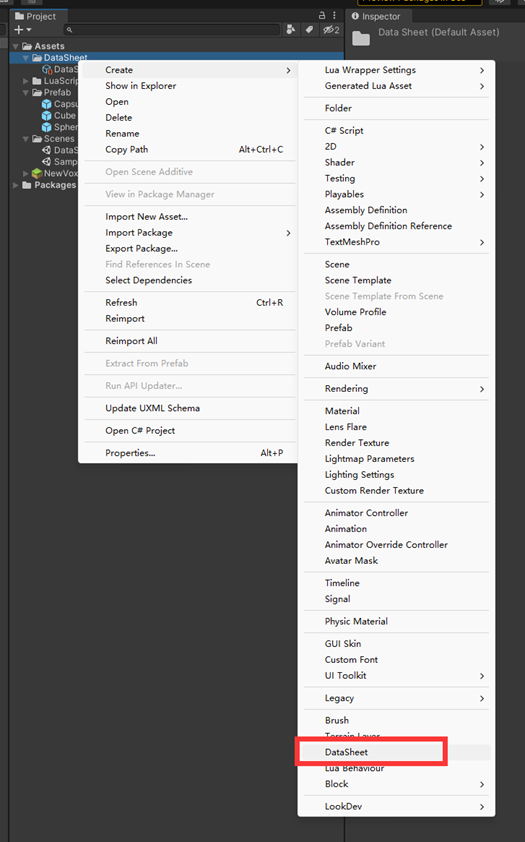
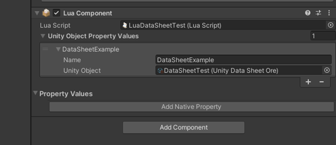
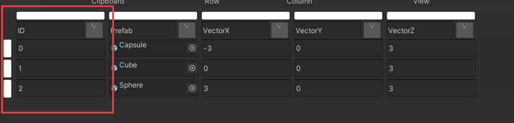
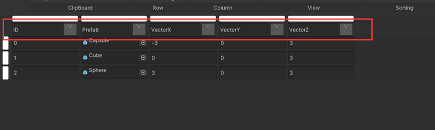

# DataSheet

1. 데이터시트 클래스 데이터 생성

2. 데이터 시트를 Lua 스크립트에 첨부하고 이름을 지정합니다.

3. Lua에서 변수 선언 및 네임스페이스 참조
```Lua
local UnityDataSheetOre = USGFramework.Runtime.USGAsset.UnityDataSheetOre
```
4. 첨부된 데이터 시트 가져오기
```Lua
DataSheet = thisLuaComponent:GetUnityObjectPropertyValueByIndex(0).UnityObject
```
5. 데이터 시트를 받는데 사용할 값을 선언 합니다. GetValue에 대한 반환 값


여기서 RowIndex는 DataSheet에 있는 행의 번호입니다(첫 번째 열의 ID가 아니라 실제 행 Number임)


"prefab"은 테이블 맨 위에 있는 헤더 이름입니다.

Lua 예제는 다음과 같습니다.

```Lua
LuaDataSheetTest = {}
 
function LuaDataSheetTest.GetTable()
    local this = {}
    local GameObject = UnityEngine.GameObject
    local thisGameObject
    local thisLuaComponent
    local thisTransform
    local UnityDataSheetOre=USGFramework.Runtime.USGAsset.UnityDataSheetOre
    local KeyCode=UnityEngine.KeyCode
    local Input=UnityEngine.Input
    local dataSheet
    local rowIndex=0
    local columName='Prefab'
    local value
    local VectorX='VectorX'
    local VectorY='VectorY'
    local VectorZ='VectorZ'
    local position
    local object
 
     
    -- Awake
    function this.Awake(luaComponentInfo)
        thisGameObject = luaComponentInfo.TargetGameObject   
        thisTransform = luaComponentInfo.TargetTransform
        thisLuaComponent = luaComponentInfo.Owner  
    end
     
    -- Start is called before the first frame update
    function this.Start()
        dataSheet = thisLuaComponent:GetUnityObjectPropertyValueByIndex(0).UnityObject
         
    end
     
    -- Update is called once per frame
    function this.Update()
        if (Input.GetKeyDown(KeyCode.Space)) then
 
            if(object ~= nil)then
                GameObject.Destroy(object)
            end
 
            value = dataSheet:GetValue(rowIndex, 'Prefab')
            this.GetPositon(rowIndex)
            object = GameObject.Instantiate(value, position, Quaternion.identity)
        end
 
        if(Input.GetKeyDown(KeyCode.E)) then
            rowIndex = rowIndex + 1
            rowIndex = rowIndex % 3
        end
    end
     
    function this.GetPositon(index)
        local Vector3X = dataSheet:GetValue(index, 'VectorX')
        local Vector3Y = dataSheet:GetValue(index, 'VectorY')
        local Vector3Z = dataSheet:GetValue(index, 'VectorZ')
        position = Vector3(Vector3X, Vector3Y, Vector3Z)
    end
 
    return this
end
```