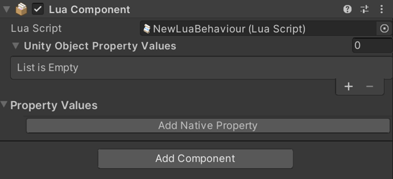
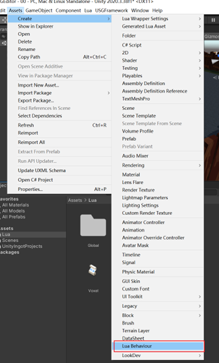
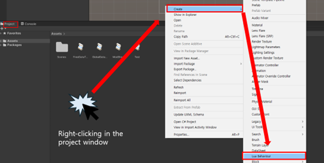
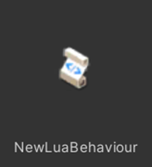

# API 개요

## 소개

USG Editor 는 LuaComponent 관련 API, VoxelTerrain 관련 API, 네트워크 관련 API, 그리고 Lua 가 호출할 수 있는 UnityEngine Runtime API 네 가지 종류의 Lua API 를 사용자에게 제공합니다.

이 매뉴얼은 터레인 API 목록, 네트워크 API 목록의 소개와 활용 사례를 제공합니다. Runtime Lua API 에 관해서는 Unity C#API 문서 사용와 함께 사용해야 하며, USG Editor 는 Game Play 와 관련된 대부분의 [UnityEngine C# API](https://docs.unity3d.com/2020.3/Documentation/ScriptReference/index.html) 를 공개했습니다.  

추가로 필요한 경우, 이 매뉴얼에서 제공하는 테스트 케이스를 사용하여 이 API 가 공개되는지 확인해 볼 수 있습니다. 상품을 최종적으로 전달한 후 USG Editor 는 SGE 관련 개발 및 유지 관리 담당자가 사용할 수 있도록 오픈 API 에 대한 기술 문서를 제공합니다

## Lua Behaviour Component
Lua Behaviour 컴포넌트는 Editor 중 Lua 스크립트를 탑재한 컴포넌트입니다. 사용자는
이 컴포넌트를 자유롭게 생성하여 Lua 스크립트를 편집할 수 있으며, 이것을 컴포넌트
형식으로 GameObject 에 마운트할 수 있습니다 

### 구성 요소 속성
|           **속성**           |                                                            **기능**                                                            |
|:--------------------------:|:----------------------------------------------------------------------------------------------------------------------------:|
| UnityObjectPropertyValues  |                              사용자는 이 목록에 다양한 UnityObject를 추가한 다음 Lua 스크립트를 통해 이와 상호 작용할 수 있습니다.                               |
|            속성값             | 사용자는 5가지 유형(Int, Float, String, Bool, Vector2 및 Vector3)의 속성 데이터를 컴포넌트의 Lua 스크립트에 추가한 다음, Lua 스크립트에서 이러한 속성 데이터를 사용할 수 있습니다. |

## Lua Behaviour 컨포넌트 생성

메뉴에서 ‘Assets→Create→Lua Behaviour’를 클릭하여 Lua Behaviour 컴포넌트를 생성합니다.

또는 Project 패널에서 오른쪽 클릭한 후 ‘Create->Lua Behaviour’를 클릭하여 컴포넌트를 생성합니다.

{width="100"}

