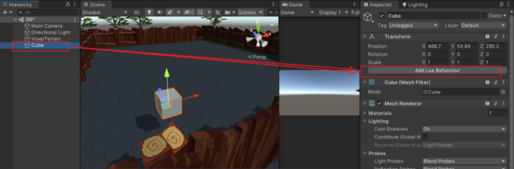
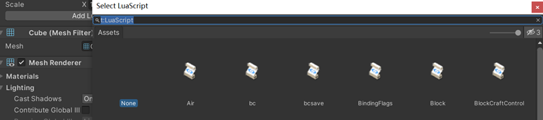
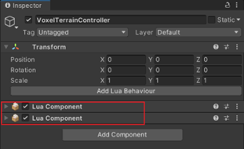
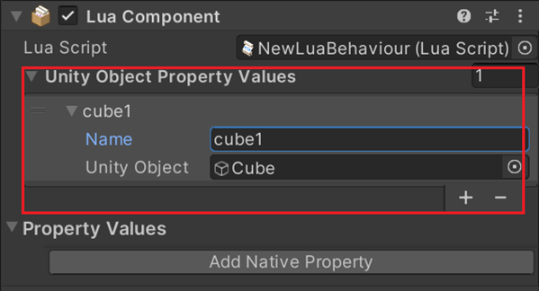
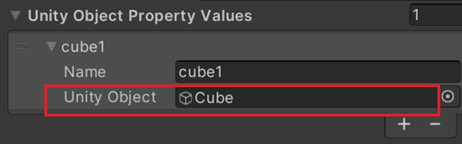
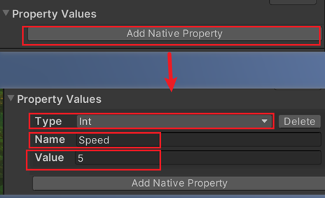
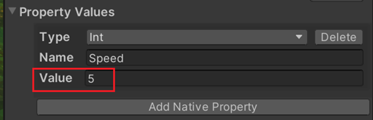
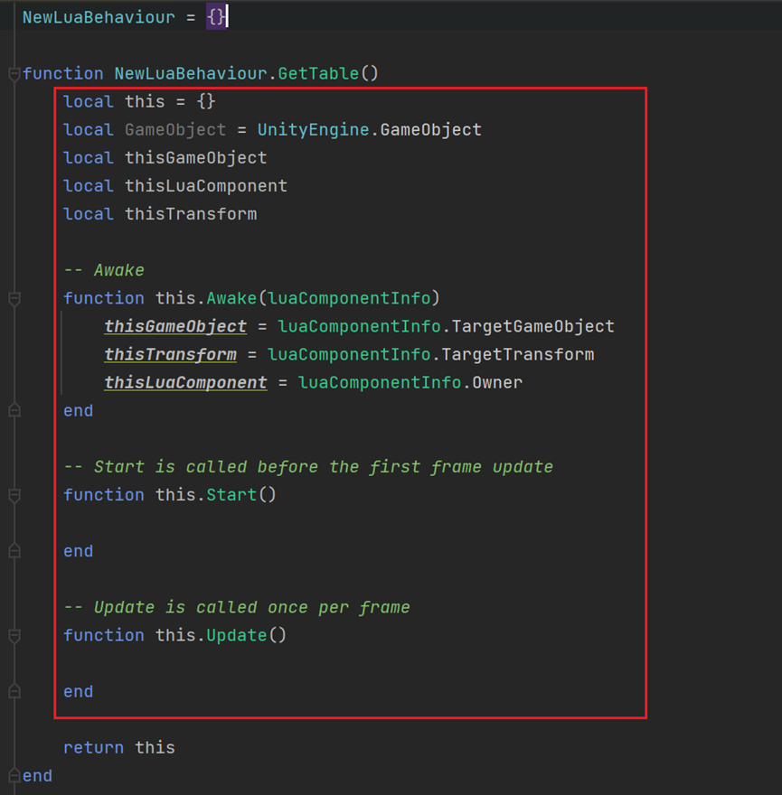

# Lua Component

## 소개

Lua Component API 는 코드와 Lua Behaviour 데이터 프로퍼티의 상호 작용을 가능하게 하며 이벤트 바인딩과 이벤트 모니터링, 이벤트 호출 API 를 제공합니다.

## 사용시 주의사항

1. 사용 시 Lua Behaviour 를 GameObject 에 추가해야 합니다. Lua를 GameObject에 추가하는 절차는 다음과 같습니다.
 * Hierarchy 패널에서 Lua 스크립트를 추가할 GameObject 를 선택합니다.
 * 
 * Add Lua Behaviour 버튼을 클릭합니다  
 * 
 * Select LuaScript 팝업창에서 마운트할 Lua 스크립트를 선택합니다

2. GameObject 는 여러 개의 Lua 스크립트를 마운트할 수 있습니다.
 * Lua component 에 Unity Object Property Values 를 수동으로 추가하고 대응하는Object 를 명명한 후 드래그합니다.
 * 
3. Lua는 다음과 같이 UnityObjectPropertyValues와 상호 작용합니다
 * 
 * Lua 코드에 thisLuaComponent:GetUnityObjectPropertyValueByName(" ")을 입력하여 Value 오브젝트를 얻습니다.
 * ``` local cube1 = thisLuaComponent:GetUnityObjectPropertyValueByName("cube1") ```
 * 또는 thisLuaComponentGetUnityObjectPropertyValueByIndex()을 통해 Value오브젝트를 얻습니다.
 * ``` local cube1 = thisLuaComponent:GetUnityObjectPropertyValueByIndex(0) ```
 * Cube 자체를 가져와야 한다면 .UnityObject 를 사용하여 가져올 수 있습니다
 * 
 * ``` local cube = thisLuaComponent:GetUnityObjectPropertyValueByIndex(0).UnityObject ```
4. Lua 를 PropertyValues 와 상호 작용하는 절차는 아래와 같습니다
 * 먼저 lua component 에서 Add Native Property 를 클릭하고 프로퍼티를 추가합니다.
 * 해당 유형(int, float, string, bool, vector2, vector3 유형 지원)을 명명하고 선택한 후대입합니다.
 * 
 * Lua 코드에서 thisLuaComponent: GetNativePropertyByName("")을 통해 Value 를 얻습니다.
 * 또는 thisLuaComponent:GetNativePropertyByIndex()를 통해 Value 오브젝트를 얻습니다
 * ``` lcoal speed = thisLuaComponent:GetNativePropertyByName("Speed") ```
``` lua
lcoal test1 = thisLuaComponent:GetNativePropertyByIndex(0)
print(Test1.Name)
print(Test1.Value)
```
 * 
* ``` lcoal speed = thisLuaComponent:GetNativePropertyByName("Speed").Value ```
5. 모든 코드는 반드시 스크린샷에 표시된 영역에 작성해야 합니다. 이 영역은 C#의MonoBehaviour 와 같다고 이해할 수 있으며 마찬가지로 Awake, Start, Update 등과 같은 라이프사이클 함수를 갖추고 있습니다
 * 
 * 새로운 함수를 추가할 경우 다음과 같이 this.FunctionName 의 형식으로 정의합니다.
``` lua
function this.Test()
    print(var0: "text function")
end
```
OnDisable 메서드 하나를 추가해야 하는 경우 위의 스크린샷과 같이 this.OnDisable 메서드를 추가하면 됩니다.
## List of Lua Behaviour APIs

| API Function Name                                                           | Functional Description                                                                                   |
|-----------------------------------------------------------------------------|----------------------------------------------------------------------------------------------------------|
| [TriggerEvent](Trigger.md)                                                  | 이벤트를 트리거합니다.                                                                                             |
| [StopListenToEvent](StopListenToEvent.md)                                   | 이벤트 모니터링을 중지합니다.                                                                                         |
| [StartListenToEvent](StartListenToEvent.md)                                 | 이벤트를 모니터링하고 콜백을 바인딩할 수 있습니다.                                                                             |
| [SetSyncedString](SetSyncedString.md)                                       | 데이터 동기화를 위해 서버로 전달되는 LuaScript(LuaComponent)에 대한 문자열을 설정합니다                                              |
| [SetSyncedNumber](SetSyncedNumber.md)                                       | 데이터 동기화를 위해 서버로 전달되는 현재 Lua 스크립트(thisLuaComponent)에 대해 명명된 숫자 값을 설정합니다                                   |
| [GetUnityObjectPropertyValueByName](GetUnityObjectPropertyValueByName.md)   | 이름을 통해 Lua Behaviour 컴포넌트의 Unity Object Property Value 컬렉션 내에 지정된 오브젝트를 얻습니다                             |
| [GetUnityObjectPropertyValueByIndex](GetUnityObjectPropertyValueByIndex.md) | 인덱스를 통해 Lua Behaviour 컴포넌트의 Unity Object Property Value 컬렉션 내에 지정된 오브젝트를 얻습니다.                           | 
| [GetSyncedString](GetSyncedString.md)                                       | 이전 SetSyncedString에서 해당이름으로 설정한 문자열 값 을 가져옵니다. 값이 없으면 기본 값이 반환됩니다.                                       |
| [GetSyncedNumber](GetSyncedNumber.md)                                       | 이전 SetSyncedString에서 해당이름으로 설정한 숫자 값 을 가져옵니다. 값이 없으면 기본 값이 반환됩니다.                                        |
| [GetNativePropertyByName](GetNativePropertyByName.md)                       | 이름을 통해 Lua Behaviour 컴포넌트의 Unity Property Value 컬렉션 내에 지정된 프로퍼티를 얻습니다.                                   |
| [GetNativePropertyByIndex](GetNativePropertyByIndex.md)                     | 인덱스를 통해 Lua Behaviour 컴포넌트의 Unity Property Value 컬렉션 내에 지정된 프로퍼티를 얻습니다.                                  |
| [GetAllUnityObjectPropertyValue](GetAllUnityObjectPropertyValue.md)         | Lua Behaviour 컴포넌트의 Unity Object Property Value 컬렉션 내의 모든 오브젝트를 얻고 호출자에게 UnityObjectProperty 의 배열을 반환합니다 |
| [GetAllNativeProperty](GetAllNativeProperty.md)                             | Lua Behaviour 컴포넌트의 Unity Property Value 컬렉션 내의 모든 프로퍼티를 얻고 호출자에게 NativePropert 의 배열을 반환합니다.             |


