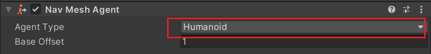
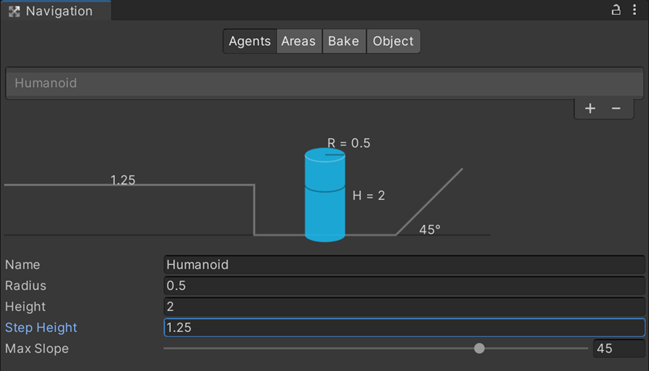
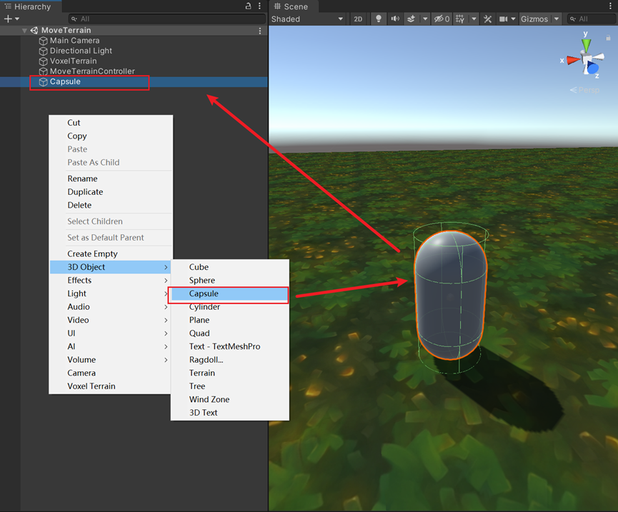
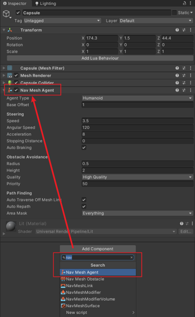
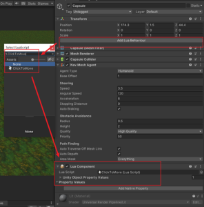

# Nav Mesh Lua

## API 목록

| 명칭                         | 메뉴얼 링크                                                                                                             |
|----------------------------|--------------------------------------------------------------------------------------------------------------------|
| SetDestination             | [](https://docs.unity3d.com/2020.3/Documentation/ScriptReference/AI.NavMeshAgent.SetDestination.html)              |
| ActivateCurrentOffMeshLink | [](https://docs.unity3d.com/2020.3/Documentation/ScriptReference/AI.NavMeshAgent.ActivateCurrentOffMeshLink.html)  |
| CompleteOffMeshLink        | [](https://docs.unity3d.com/2020.3/Documentation/ScriptReference/AI.NavMeshAgent.CompleteOffMeshLink.html )        |
| Warp                       | [](https://docs.unity3d.com/2020.3/Documentation/ScriptReference/AI.NavMeshAgent.Warp.html        )                |
| Move                       | [](https://docs.unity3d.com/2020.3/Documentation/ScriptReference/AI.NavMeshAgent.Move.html            )            |
| ResetPath                  | [](https://docs.unity3d.com/2020.3/Documentation/ScriptReference/AI.NavMeshAgent.ResetPath.html          )         |
| SetPath                    | [](https://docs.unity3d.com/2020.3/Documentation/ScriptReference/AI.NavMeshAgent.SetPath.html                )     |
| FindClosestEdge            | [](https://docs.unity3d.com/2020.3/Documentation/ScriptReference/AI.NavMeshAgent.FindClosestEdge.html        )     |
| Raycast                    | [](https://docs.unity3d.com/2020.3/Documentation/ScriptReference/AI.NavMeshAgent.Raycast.html                  )   |
| CalculatePath              | [](https://docs.unity3d.com/2020.3/Documentation/ScriptReference/AI.NavMeshAgent.CalculatePath.html            )   |
| SamplePathPosition         | [](https://docs.unity3d.com/2020.3/Documentation/ScriptReference/AI.NavMeshAgent.SamplePathPosition.html        )  |
| SetAreaCost                | [](https://docs.unity3d.com/2020.3/Documentation/ScriptReference/AI.NavMeshAgent.SetAreaCost.html                ) |
| GetAreaCost                | [](https://docs.unity3d.com/2020.3/Documentation/ScriptReference/AI.NavMeshAgent.GetAreaCost.html                ) |
| destination                | [](https://docs.unity3d.com/2020.3/Documentation/ScriptReference/AI.NavMeshAgent-destination.html                ) |
| stoppingDistance           | [](https://docs.unity3d.com/2020.3/Documentation/ScriptReference/AI.NavMeshAgent-stoppingDistance.html           ) |
| velocity                   | [](https://docs.unity3d.com/2020.3/Documentation/ScriptReference/AI.NavMeshAgent-velocity.html                  )  |
| nextPosition               | [](https://docs.unity3d.com/2020.3/Documentation/ScriptReference/AI.NavMeshAgent-nextPosition.html              )  |
| steeringTarget             | [](https://docs.unity3d.com/2020.3/Documentation/ScriptReference/AI.NavMeshAgent-steeringTarget.html            )  |
| desiredVelocity            | [](https://docs.unity3d.com/2020.3/Documentation/ScriptReference/AI.NavMeshAgent-desiredVelocity.html          )   |
| remainingDistance          | [](https://docs.unity3d.com/2020.3/Documentation/ScriptReference/AI.NavMeshAgent-remainingDistance.html         )  |
| baseOffset                 | [](https://docs.unity3d.com/2020.3/Documentation/ScriptReference/AI.NavMeshAgent-baseOffset.html                 ) |
| isOnOffMeshLink            | [](https://docs.unity3d.com/2020.3/Documentation/ScriptReference/AI.NavMeshAgent-isOnOffMeshLink.html            ) |
| currentOffMeshLinkData     | [](https://docs.unity3d.com/2020.3/Documentation/ScriptReference/AI.NavMeshAgent-currentOffMeshLinkData.html     ) |
| nextOffMeshLinkData        | [](https://docs.unity3d.com/2020.3/Documentation/ScriptReference/AI.NavMeshAgent-nextOffMeshLinkData.html       )  |
| autoTraverseOffMeshLink    | [](https://docs.unity3d.com/2020.3/Documentation/ScriptReference/AI.NavMeshAgent-autoTraverseOffMeshLink.html   )  |
| autoBraking                | [](https://docs.unity3d.com/2020.3/Documentation/ScriptReference/AI.NavMeshAgent-autoBraking.html               )  |
| autoRepath                 | [](https://docs.unity3d.com/2020.3/Documentation/ScriptReference/AI.NavMeshAgent-autoRepath.html                )  |  
| hasPath                    | [](https://docs.unity3d.com/2020.3/Documentation/ScriptReference/AI.NavMeshAgent-hasPath.html                   )  |
| pathPending                | [](https://docs.unity3d.com/2020.3/Documentation/ScriptReference/AI.NavMeshAgent-pathPending.html                ) |
| isPathStale                | [](https://docs.unity3d.com/2020.3/Documentation/ScriptReference/AI.NavMeshAgent-isPathStale.html               )  |
| pathStatus                 | [](https://docs.unity3d.com/2020.3/Documentation/ScriptReference/AI.NavMeshAgent-pathStatus.html                )  |
| isStopped                  | [](https://docs.unity3d.com/2020.3/Documentation/ScriptReference/AI.NavMeshAgent-isStopped.html                 )  |
| path                       | [](https://docs.unity3d.com/2020.3/Documentation/ScriptReference/AI.NavMeshAgent-path.html                      )  |
| navMeshOwner               | [](https://docs.unity3d.com/2020.3/Documentation/ScriptReference/AI.NavMeshAgent-navMeshOwner.html              )  |
| agentTypeID                | [](https://docs.unity3d.com/2020.3/Documentation/ScriptReference/AI.NavMeshAgent-agentTypeID.html                ) |
| areaMask                   | [](https://docs.unity3d.com/2020.3/Documentation/ScriptReference/AI.NavMeshAgent-areaMask.html                  )  |
| speed                      | [](https://docs.unity3d.com/2020.3/Documentation/ScriptReference/AI.NavMeshAgent-speed.html                      ) |
| angularSpeed               | [](https://docs.unity3d.com/2020.3/Documentation/ScriptReference/AI.NavMeshAgent-angularSpeed.html              )  |
| acceleration               | [](https://docs.unity3d.com/2020.3/Documentation/ScriptReference/AI.NavMeshAgent-acceleration.html              )  |
| updatePosition             | [](https://docs.unity3d.com/2020.3/Documentation/ScriptReference/AI.NavMeshAgent-updatePosition.html            )  |
| updateRotation             | [](https://docs.unity3d.com/2020.3/Documentation/ScriptReference/AI.NavMeshAgent-updateRotation.html            )  |
| updateUpAxis               | [](https://docs.unity3d.com/2020.3/Documentation/ScriptReference/AI.NavMeshAgent-updateUpAxis.html              )  |
| radius                     | [](https://docs.unity3d.com/2020.3/Documentation/ScriptReference/AI.NavMeshAgent-radius.html                    )  |
| height                     | [](https://docs.unity3d.com/2020.3/Documentation/ScriptReference/AI.NavMeshAgent-height.html                    )  |
| obstacleAvoidanceType      | [](https://docs.unity3d.com/2020.3/Documentation/ScriptReference/AI.NavMeshAgent-obstacleAvoidanceType.html     )  |
| avoidancePriority          | [](https://docs.unity3d.com/2020.3/Documentation/ScriptReference/AI.NavMeshAgent-avoidancePriority.html        )   |
| isOnNavMesh                | [](https://docs.unity3d.com/2020.3/Documentation/ScriptReference/AI.NavMeshAgent-isOnNavMesh.html               )  |

## 사용 절차 및 주의사항

* Voxel Terrain 은 자동으로 베이크된 것이며, 다른 오브젝트를 베이크해야 하는 경우 사용자가 직접 베이크 시스템을 조작해야 합니다.
* Voxel Terrain 의 터레인 데이터가 방대하기 때문에 NavMesh 의 효율이 조금 떨어집니다. 이는 정상적인 현상입니다
* 소유자만 enable nav mesh agent 를 선택할 수 있고 소유자가 아닌 경우에는disable 을 선택해야 네트워크 동기화를 확보할 수 있습니다
*  현재 Nav Mesh Agent Type 은 Humanoid 만 지원합니다.

## 참고 사례
이 사례에서는 캡슐이 클릭한 위치로 이동하도록 합니다.
* 먼저, Hierarchy 패널 아래에 캡슐을 생성합니다.
* 
* Inspector 패널에서 캡슐에 Nav Mesh Agent 컴포넌트를 마운트합니다.
* 
* Lua Behaviour 파일을 생성하고 이 파일을 ClickToMove 라고 명명한 후 캡슐 위에 이 Lua 스크립트를 추가합니다.
* 
* Inspector 패널에서 캡슐에 Lua Component 를 마운트합니다. Unity Object Property Values 에 프로퍼티를 추가하고 이름을 MyAgent 라고 지정한 후 Nav Mesh Agent 컴포넌트를 Unity Object 로 드래그합니다
* 
* 이 Lua 스크립트에 아래와 같은 코드를 작성합니다
``` lua
ClickToMove = {}
 
function ClickToMove.GetTable()
    local this = {}
    local GameObject = UnityEngine.GameObject
    local thisGameObject
    local thisLuaComponent
    local thisTransform
    local Input = UnityEngine.Input
    local navMeshAgent
    local NetworkUtility = USGFramework.Runtime.Core.USGNetwork.NetworkUtility
    local isNavMeshAgentEnabled = true;
     
    -- Awake
    function this.Awake(luaComponentInfo)
        thisGameObject = luaComponentInfo.TargetGameObject   
        thisTransform = luaComponentInfo.TargetTransform
        thisLuaComponent = luaComponentInfo.Owner
        navMeshAgent = thisLuaComponent:GetUnityObjectPropertyValueByIndex(0).UnityObject
    end
     
    -- Start is called before the first frame update
    function this.Start()
         
    end
     
    -- Update is called once per frame
    function this.Update()
        if(NetworkUtility.IsOwner(thisGameObject) == false)
        then
            if(isNavMeshAgentEnabled == true)
            then
                navMeshAgent.enabled = false;
                isNavMeshAgentEnabled = false;
            end
        end
 
        if(NetworkUtility.IsOwner(thisGameObject) == true)
        then
            if(isNavMeshAgentEnabled == false)
            then
                navMeshAgent.enabled = true;
                isNavMeshAgentEnabled = true;
            end
        end
 
        if(isNavMeshAgentEnabled == false)
        then
            return
        end
 
        if(Input.GetMouseButtonDown(0))
        then
            local camera = UnityEngine.Camera.main
            local ray  = camera:ScreenPointToRay(Input.mousePosition)
            local flag, hit = UnityEngine.Physics.Raycast(ray, nil, 5000)
             
            if flag
            then               
                print('ray hit at point: '..tostring(hit.point))
                local pos = hit.point
 
                navMeshAgent.destination = pos
 
            end
        end
    end
     
    return this
end
```

* 게임을 실행하고 터레인을 클릭하면 캡슐이 클릭한 위치로 이동합니다.
* 
