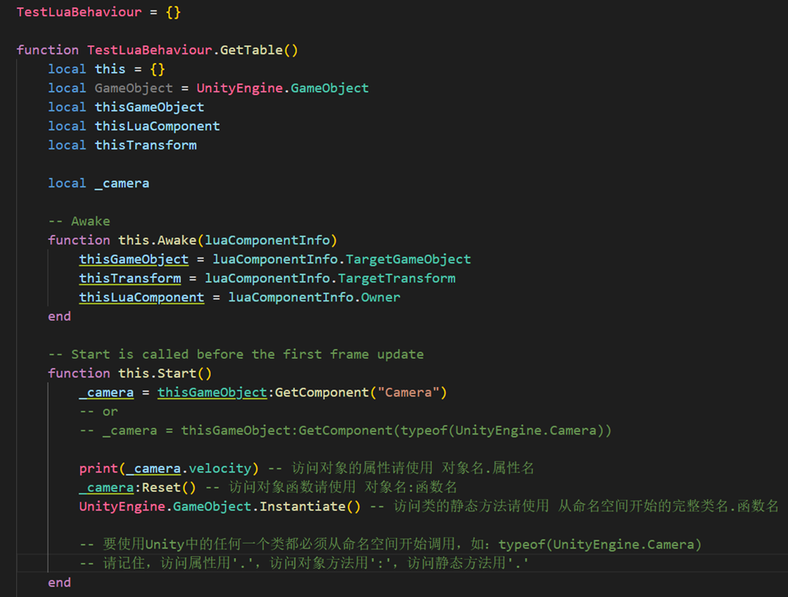
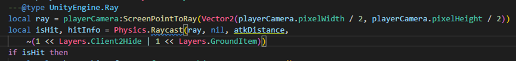

# Unity RunTime Lua
## 소개

USG Editor 는 Game Play 와 관련된 대부분의 UnityEngine C# API 를 공개했습니다. 추가로
필요한 경우, 이 매뉴얼에서 제공하는 테스트 케이스를 사용하여 이 API 가 공개되는지 확인해 볼
수 있습니다. 상품을 최종적으로 전달한 후 USG Editor 는 SGE 관련 개발 및 유지 관리 담당자가
사용할 수 있도록 오픈 API 에 대한 기술 문서를 제공합니다

## 사용 시 주의사항

1. Use Unity APIs in Lua
* 
* UnityEngine.GameObject.New(“”)와 같이 ‘전체 네임스페이스 경로의 클래스 이름.New’ 메서드를 사용하여 오브젝트를 생성합니다.
UnityEngine.GameObject(“”)와 같이 ‘전체 네임스페이스 경로의 클래스 이름()’을 사용하여 오브젝트를 생성할 수도 있습니다.
비정적 메서드는 ‘오브젝트명:메서드명’의 형식에 따라 호출합니다.
정적 메서드는 ‘전체 네임스페이스 경로의 클래스 이름.메서드명’의 형식에 따라 호출합니다.
프로퍼티는 ‘전체 네임스페이스 경로의 클래스 이름.프로퍼티명’ 또는 ‘오브젝트명.프로퍼티명’의 형식에 따라 호출합니다
2. out 또는 ref 파라미터가 표시되면 스크린샷과 같이 적용하면 됩니다. Nil 파라미터를 입력하고 앞쪽에 변수를 하나 추가하여 out/ref 결과를 가져옵니다.
* 
* the result.

3. 일부 API 의 파라미터에서 다른 long 클래스를 받아들일 수 있습니다. 다만 이러한 클래스는 Wrap 파일을 생성하지 않아 외부 클래스인 API 를 사용할 때 아무런 문제가 없어 보이나, 내부 클래스에서 이 유형을 가진 오브젝트의 프로퍼티 또는 메서드에 접근할 수 없는 문제가 발생합니다.
* 여기서 이 OnTriggerEnter 함수는 정상적으로 사용 가능하지만 collider 의 세부 정보에 접근하려고 하면 파라미터 유형이 Wrap 파일 생성을 바인딩하지 않았으므로 오류가 표시될 것입니다.
4. Unity 인터페이스를 지원하지 않습니다.
5. Unity의 이벤트 시스템을 지원하지 않습니다.

## Unity API 목록

링크를 클릭하면 Unity 파일로 넘어갑니다

* Lifecycle-related APIs

| Name                    | Manual Link                                                                             |
|-------------------------|-----------------------------------------------------------------------------------------|
| OnEnable                | [](https://docs.unity3d.com/ScriptReference/MonoBehaviour.OnEnable.html)                |
| OnDisable               | [](https://docs.unity3d.com/ScriptReference/MonoBehaviour.OnDisable.html)               |
| Start                   | [](https://docs.unity3d.com/ScriptReference/MonoBehaviour.Start.html)                   |
| FixedUpdate             | [](https://docs.unity3d.com/ScriptReference/MonoBehaviour.FixedUpdate.html)             |
| OnDestroy               | [](https://docs.unity3d.com/ScriptReference/MonoBehaviour.OnDestroy.html)               |
| OnTriggerStay           | [](https://docs.unity3d.com/ScriptReference/MonoBehaviour.OnTriggerStay.html)           |
| OnTriggerExit           | [](https://docs.unity3d.com/ScriptReference/MonoBehaviour.OnTriggerExit.html)           |
| OnCollisionEnter        | [](https://docs.unity3d.com/ScriptReference/MonoBehaviour.OnCollisionEnter.html)        |
| OnCollisionStay         | [](https://docs.unity3d.com/ScriptReference/MonoBehaviour.OnCollisionStay.html)         |
| OnCollisionExit         | [](https://docs.unity3d.com/ScriptReference/MonoBehaviour.OnCollisionExit.html)         |
| OnControllerColliderHit | [](https://docs.unity3d.com/ScriptReference/MonoBehaviour.OnControllerColliderHit.html) |
| OnMouseDown             | [](https://docs.unity3d.com/ScriptReference/MonoBehaviour.OnMouseDown.html)             |
| Update                  | [](https://docs.unity3d.com/ScriptReference/MonoBehaviour.Update.html)                  |
| LateUpdate              | [](https://docs.unity3d.com/ScriptReference/MonoBehaviour.LateUpdate.html)  |
| OnApplicationFocus              | [](https://docs.unity3d.com/ScriptReference/MonoBehaviour.OnApplicationFocus.html)    |
| OnApplicationPause              | [](https://docs.unity3d.com/ScriptReference/MonoBehaviour.OnApplicationPause.html)     |


| Name                    | Manual Link                                                                                |
|-------------------------|--------------------------------------------------------------------------------------------|
| Application	            | [](https://docs.unity3d.com/ScriptReference/Application.html)                              |
| Time	                   | [](https://docs.unity3d.com/ScriptReference/Time.html)                                     |
| Screen	                 | [](https://docs.unity3d.com/ScriptReference/Screen.html    )                                |
| SleepTimeout	           | [](https://docs.unity3d.com/ScriptReference/Screen-sleepTimeout.html   )                    |
| Input	                  | [](https://docs.unity3d.com/ScriptReference/Input.html)                                     |
| KeyCode	                | [](https://docs.unity3d.com/ScriptReference/KeyCode.html)                                   |
| Physics	                | [](https://docs.unity3d.com/ScriptReference/Physics.html)                                   |
| Graphics	               | [](https://docs.unity3d.com/ScriptReference/Graphics.html)                                  |
| Component	              | [](https://docs.unity3d.com/ScriptReference/Component.html  )                               |
| Transform	              | [](https://docs.unity3d.com/ScriptReference/Transform.html  )                               |
| Material	               | [](https://docs.unity3d.com/ScriptReference/Material.html     )                             |
| Light                   | 	[](https://docs.unity3d.com/ScriptReference/Light.html    )                                |
| LightType	              | [](https://docs.unity3d.com/ScriptReference/Experimental.GlobalIllumination.LightType.html) |
| Rigidbody	              | [](https://docs.unity3d.com/ScriptReference/Rigidbody.html    )                             |
| Camera                  | 	[](https://docs.unity3d.com/ScriptReference/Camera.html  )                                 |
| AudioSource             | [](https://docs.unity3d.com/ScriptReference/AudioSource.html    )                           |
| AudioClip               | [](https://docs.unity3d.com/ScriptReference/AudioClip.html     )                            |
| AssetBundle             | [](https://docs.unity3d.com/ScriptReference/AssetBundle.html     )                          |
| Behaviour               | 	[](https://docs.unity3d.com/ScriptReference/Behaviour.html    )                            |
| MonoBehaviour           | 	[](https://docs.unity3d.com/ScriptReference/MonoBehaviour.html  )                          |
| GameObject	             | [](https://docs.unity3d.com/ScriptReference/GameObject.html      )                          |
| Collider                | 	[](https://docs.unity3d.com/ScriptReference/Collider.html       )                          |
| MeshCollider            | 	[](https://docs.unity3d.com/ScriptReference/MeshCollider.html     )                        |
| SphereCollider          | 	[](https://docs.unity3d.com/ScriptReference/SphereCollider.html       )                    |
| CharacterController	    | [](https://docs.unity3d.com/ScriptReference/CharacterController.html     )                  |
| CapsuleCollider	        | [](https://docs.unity3d.com/ScriptReference/CapsuleCollider.html          )                 |
| BoxCollider	            | [](https://docs.unity3d.com/ScriptReference/BoxCollider.html         )                      |
| Collision	              | [](https://docs.unity3d.com/ScriptReference/Collision.html       )                          |
| Texture	                | [](https://docs.unity3d.com/ScriptReference/Texture.html          )                         |
| Texture2D	              | [](https://docs.unity3d.com/ScriptReference/Texture2D.html      )                           |
| Shader                  | 	[](https://docs.unity3d.com/ScriptReference/Shader.html          )                         |
| Renderer                | 	[](https://docs.unity3d.com/ScriptReference/Renderer.html          )                       |
| RenderTexture	          | [](https://docs.unity3d.com/ScriptReference/RenderTexture.html    )                         |
| MeshRenderer            | 	[](https://docs.unity3d.com/ScriptReference/MeshRenderer.html        )                    |
| UnityWebRequest         | 	[](https://docs.unity3d.com/ScriptReference/Networking.UnityWebRequest.html )              |
| Animation               | 	[](https://docs.unity3d.com/ScriptReference/Animation.html          )                      |
| AnimationClip	          | [](https://docs.unity3d.com/ScriptReference/AnimationClip.html     )                        |
| AnimationState	         | [](https://docs.unity3d.com/ScriptReference/AnimationState.html     )                       |
| AnimatorClipInfo	       | [](https://docs.unity3d.com/ScriptReference/AnimatorClipInfo.html     )                     |
| ParticleSystem          | 	[](https://docs.unity3d.com/ScriptReference/ParticleSystem.html      )                     |
| SkinnedMeshRenderer	    | [](https://docs.unity3d.com/ScriptReference/SkinnedMeshRenderer.html    )                   |
| SkinWeights	            | [](https://docs.unity3d.com/ScriptReference/SkinWeights.html            )                   |
| Canvas                  | 	[](https://docs.unity3d.com/ScriptReference/Canvas.html             )                      |
| CanvasGroup             | 	[](https://docs.unity3d.com/ScriptReference/CanvasGroup.html       )                       |
| RectTransform	          | [](https://docs.unity3d.com/ScriptReference/RectTransform.html      )                       |
| RectOffset	             | [](https://docs.unity3d.com/ScriptReference/RectOffset.html         )                       |
| NavMesh                 | 	[](https://docs.unity3d.com/ScriptReference/AI.NavMesh.html      )                         |
| ScriptableObject	       | [](https://docs.unity3d.com/ScriptReference/ScriptableObject.html    )                      |
| TextAsset               | 	[](https://docs.unity3d.com/ScriptReference/TextAsset.html       )                         |
| Cursor	                 | [](https://docs.unity3d.com/ScriptReference/Cursor.html               )                     |
| DataUtility	            | [](https://docs.unity3d.com/ScriptReference/Sprites.DataUtility.html        )              |
| Image                   | [](https://docs.unity3d.com/Packages/com.unity.ugui@1.0/manual/script-Image.html )          |
| Dropdown	               | [](https://docs.unity3d.com/Packages/com.unity.ugui@1.0/manual/script-Dropdown.html)       |
| Scrollbar	              | [](https://docs.unity3d.com/Packages/com.unity.ugui@1.0/manual/script-Scrollbar.html )      |
| Slider                  | 	[](https://docs.unity3d.com/Packages/com.unity.ugui@1.0/manual/script-Slider.html )        |
| Text	                   | [](https://docs.unity3d.com/Packages/com.unity.ugui@1.0/manual/script-Text.html   )         |
| Toggle                  | 	[](https://docs.unity3d.com/Packages/com.unity.ugui@1.0/manual/script-Toggle.html  )       |
| Button	                 | [](https://docs.unity3d.com/Packages/com.unity.ugui@1.0/manual/script-Button.html   )       |
| TMPro                   | 	[](https://docs.unity.cn/Packages/com.unity.textmeshpro@3.0/api/index.html   )             |
| PlayerPrefs	            | [](https://docs.unity3d.com/ScriptReference/PlayerPrefs.html     )                          |
| Joint                   | 	[](https://docs.unity3d.com/ScriptReference/Joint.html     )                              |
| CharacterJoint	         | [](https://docs.unity3d.com/ScriptReference/CharacterJoint.html    )                        |
| HingeJoint	             | [](https://docs.unity3d.com/ScriptReference/HingeJoint.html     )                           |
| SpringJoint             | 	[](https://docs.unity3d.com/ScriptReference/SpringJoint.html  )                           |
| FixedJoint	             | [](https://docs.unity3d.com/ScriptReference/FixedJoint.html    )                           |
| ConfigurableJoint	      | [](https://docs.unity3d.com/ScriptReference/ConfigurableJoint.html   )                      |
| UnityEngine.Gizmos	     | [](https://docs.unity3d.com/ScriptReference/Gizmos.html )                                   |
| UnityEngine.UI.Dropdown | 	[](https://docs.unity3d.com/Packages/com.unity.ugui@2.0/api/UnityEngine.UI.Dropdown.html ) |
| ContactPoint            | 	[](https://docs.unity3d.com/ScriptReference/ContactPoint.html )                           |
## Test Case

이 테스트 케이스는 Lua 가 Animator 와 관련된 API 를 호출할 수 있는지 테스트합니다.

이 스크립트는 API 명칭을 통해 Unity Animator API 를 획득하고 호출하는 작업을 시도하며 이를 콘솔창에 출력합니다. 콘솔창에 nil 오류가 표시된다면 현재 버전은Lua 를 통해 이 API 를 호출할 수 없습니다.

```lua
AnimatorTest = {}
 
function AnimatorTest.GetTable()
    local this = {}
    local GameObject = UnityEngine.GameObject
    local thisGameObject
    local thisLuaComponent
    local thisTransform
 
    -- Awake
    function this.Awake(luaComponentInfo)
        thisGameObject = luaComponentInfo.TargetGameObject
        thisTransform = luaComponentInfo.TargetTransform
        thisLuaComponent = luaComponentInfo.Owner
    end
 
    -- Start is called before the first frame update
    function this.Start()
        this.TestAnimationAPI()
        this.TestAnimatorStateInfoAPI()
    end
 
    -- Update is called once per frame
    function this.Update()
 
    end
 
    function this.TestAnimationAPI()
        print("================UnityEngine.Animator=======================")
        local temp = thisGameObject:GetComponent("Animator")
        local keys = {
            "angularVelocity",
            "applyRootMotion",
            "avatar",
            "bodyPosition",
            "bodyRotation",
            "cullingMode",
            "deltaPosition",
            "deltaRotation",
            "feetPivotActive",
            "fireEvents",
            "gravityWeight",
            "hasBoundPlayables",
            "hasRootMotion",
            "hasTransformHierarchy",
            "humanScale",
            "isHuman",
            "isInitialized",
            "isMatchingTarget",
            "isOptimizable",
            "keepAnimatorControllerStateOnDisable",
            "layerCount",
            "layersAffectMassCenter",
            "leftFeetBottomHeight",
            "parameterCount",
            "parameters",
            "pivotPosition",
            "pivotWeight",
            "playableGraph",
            "playbackTime",
            "recorderMode",
            "recorderStartTime",
            "recorderStopTime",
            "rightFeetBottomHeight",
            "rootPosition",
            "rootRotation",
            "runtimeAnimatorController",
            "speed",
            "stabilizeFeet",
            "targetPosition",
            "targetRotation",
            "updateMode",
            "velocity",
            "ApplyBuiltinRootMotion",
            "CrossFade",
            "CrossFadeInFixedTime",
            "GetAnimatorTransitionInfo",
            "GetBehaviours",
            "GetBoneTransform",
            "GetBool",
            "GetCurrentAnimatorClipInfo",
            "GetCurrentAnimatorClipInfoCount",
            "GetCurrentAnimatorStateInfo",
            "GetFloat",
            "GetIKHintPosition",
            "GetIKHintPositionWeight",
            "GetIKPosition",
            "GetIKPositionWeight",
            "GetIKRotation",
            "GetIKRotationWeight",
            "GetInteger",
            "GetLayerIndex",
            "GetLayerName",
            "GetLayerWeight",
            "GetNextAnimatorClipInfo",
            "GetNextAnimatorClipInfoCount",
            "GetNextAnimatorStateInfo",
            "GetParameter",
            "HasState",
            "InterruptMatchTarget",
            "IsInTransition",
            "IsParameterControlledByCurve",
            "MatchTarget",
            "Play",
            "PlayInFixedTime",
            "Rebind",
            "ResetTrigger",
            "SetBoneLocalRotation",
            "SetBool",
            "SetFloat",
            "SetIKHintPosition",
            "SetIKHintPositionWeight",
            "SetIKPosition",
            "SetIKPositionWeight",
            "SetIKRotation",
            "SetIKRotationWeight",
            "SetInteger",
            "SetLayerWeight",
            "SetLookAtPosition",
            "SetLookAtWeight",
            "SetTarget",
            "SetTrigger",
            "StartPlayback",
            "StartRecording",
            "StopPlayback",
            "StopRecording",
            "Update",
            "WriteDefaultValues",
            "StringToHash",
        }
 
        for i = 1, #keys do
            print(keys[i], temp[keys[i]])
        end
    end
 
    function this.TestAnimatorStateInfoAPI()
        print("========UnityEngine.AnimatorStateInfo==================")
        local temp = thisGameObject:GetComponent("Animator"):GetCurrentAnimatorStateInfo(0)
        local keys = {
            "fullPathHash",
            "length",
            "loop",
            "normalizedTime",
            "shortNameHash",
            "speed",
            "speedMultiplier",
            "tagHash",
            "IsName",
            "IsTag",
        }
 
        for i = 1, #keys do
            print(keys[i], temp[keys[i]])
        end
    end
 
    return this
end

```
