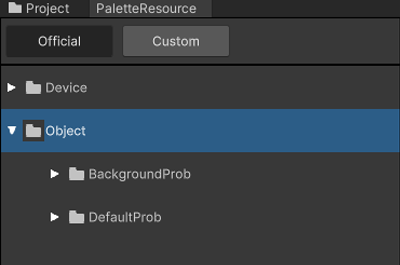
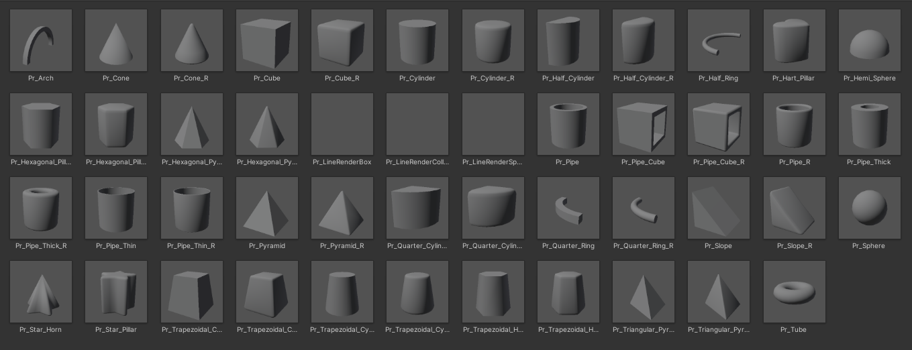
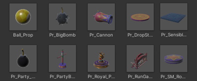

# 프랍

## 프랍이란
Scene에 월드를 레벨링 할 수 있는 3D 오브젝트입니다.  
또한 모델링이 필요한 장치의 재료로 사용할 수 있습니다.

## 팔레트 위치
  

- DefaultProp : 기본 도형 형태 프랍 구성
- BackgroundProp : Mesh 형태 프랍 구성 

### 기본 프랍
공통화된 도형 , 다각형 형태의 모델을 지원합니다.  
이 프랍은 Basic Shape Prop 폴더에 위치합니다.  

 
### 배경 프랍
 펭귄 모드에서 사용하는 공식 모델을 지원합니다.
 이 프랍은 Model Prop 폴더에 위치합니다.  

