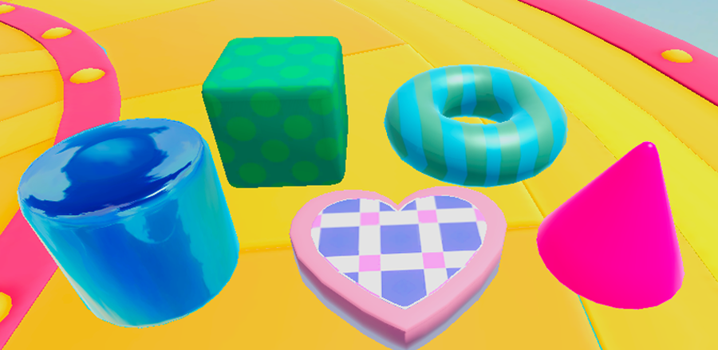
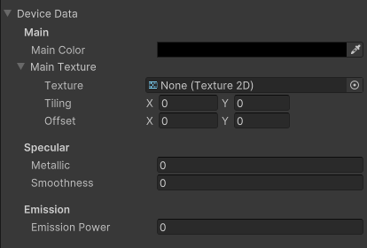
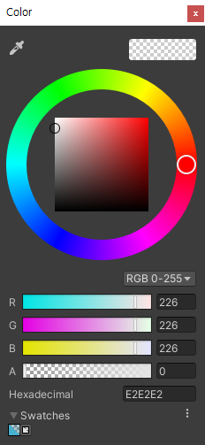
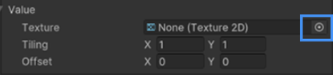
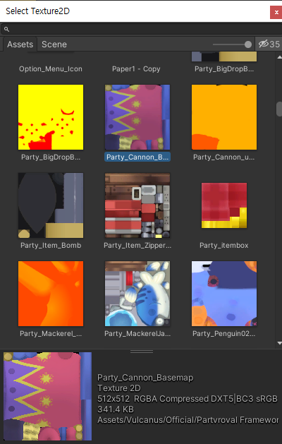

# 기본 도형 프랍

프랍은 정형화된 도형 형태 3D 오브젝트입니다.    

프랍을 활용하여 Scene 월드를 꾸밀 수 있으며, 3D 모델 형태의 기믹장치, 아이템 그 외 장치 제작에 활용할 수 있습니다.    

표면의 질감을 쉽게 설정할 수 있는 기능을 지원합니다.    
색상을 설정하거나 나만의 패턴을 설정하여 다양한 형태의 프랍 제작이 가능합니다.  
표면의 매끄러움을 조절하여 다양한 질감 제작이 가능합니다.

## 도형 종류 

  

## 옵션
 

 **Main Color**   
표면의 기본색상을 설정하는 기능입니다.   
컬러 팔레트 윈도우를 제공하여 섬세한 색상 설정이 가능합니다.     

 **Main Texture**   
표면의 형태 및 디테일을 추가할 수 있는 기능입니다.  
Select 윈도우를 통해 Texture 설정이 가능합니다.      

  

표시된 영역 클릭 시 Select Texture 윈도우를 오픈합니다  

  **Metallic**  
표면을 철질감으로 변경하는 기능입니다.  
수치가 높을수록 주변 환경을 반사하는 거울같은 질감을 제작합니다.  

 **Smoothness**  
 표면의 질감의 매끄러운 정도를 설정하는 기능입니다.   
 빛을 모으는 세기 및 광원 크기 설정이 가능합니다.

 **Emission Power**  
밝은 표면을 제작하는 기능입니다.  
표면의 질감을 주변 환경 빛 그림자 영향을 받지않습니다.   
어두운 공간에서는 밝게 보입니다.  

