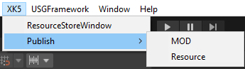

# 게임 출판

 {width="400"}
XK5-Publish-MOD 메뉴를 클릭합니다.

'Publish MOD' 버튼을 클릭하면 파티로얄 게임 빌드가 진행됩니다.  
빌드가 완료되면 XK5 출판 심사 신청 페이지가 출력됩니다.  
각 항목에 올바른 정보를 입력한 후 '제출'을 클릭합니다.
업로드 현황이 팝업되며, 최종 제출하면 심사 제출이 완료됩니다.

심사 신청한 게임은 관리가 승인 후 출판되며 프로젝트 B의 행성유랑을 통해 플레이할 수 있습니다.