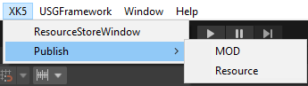

# 게임 출판

 {width="400"}
XK5-Publish-MOD 메뉴를 클릭합니다.

**여기서부터는 내부 개발용 에디터에 해당하는 내용입니다. 외부 개발사 및 일반 창작자에게 공개하지 않습니다**

1. Packager Settings의 Scenes에서 'Match' Scene을 지정합니다.
2. 'Publish MOD'를 클릭하면 빌드파일을 생성할 폴더를 선택합니다.
3. 폴더를 선택하면 빌드를 시작합니다.
4. 빌드가 완료되면 빌드 파일을 확인할 수 있으며 GMT를 통해 업로드합니다.

위 과정 및 이후 테스트 과정은 [Vulcanus UGC 출판 가이드](https://wiki.smilegate.net/pages/viewpage.action?pageId=385929573)를 참고하여 QA를 진행해 주시면 감사하겠습니다.  
