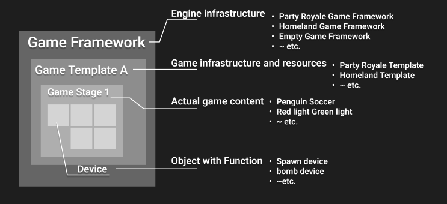

# %product% 소개 

%product%는 모드 게임을 제작할 수 있는 게임 에디터입니다. %product%의 게임프레임워크를 통해 모드를 손쉽게 제작하고 출판할 수 있습니다.

## %product%의 게임 프레임워크 

%product%에서는 모드 게임을 만들기 위한 기반 구조를 제공하며 이를 '게임 프레임워크'라고 합니다. 각 게임 프레임워크에서는 손쉽게 제작을 시작할 수 있도록 게임 템플릿을 제공하며, 창작자는 게임 템플릿을 선택하여 프로젝트를 생성할 수 있습니다.
생성된 프로젝트에서는 장치 시스템을 활용하여 나만의 모드 게임을 제작할 수 있습니다.

## 게임 프레임워크에서 제공되는 것

쉽고 빠른 게임 제작이 가능할 수 있도록 게임 프레임워크에서는 아래의 내용들을 제공합니다.

1. **전용 기능:** 해당 장르의 게임을 제작하기 위해 필요한 전용 기능을 제공. 예를 들어, 특정 장르의 서버-클라이언트 구조, 매칭 방식 등이 해당됩니다.  
2. **개발에 필요한 리소스:** 해당 장르의 게임을 제작하기 위해 필요한 리소스를 제공. 특수한 기믹 장치, 게임 배경 오브젝트 등이 해당됩니다. %product% 게임프레임워크를 통한 게임 제작에 사용되는 리소스는 별도의 형식을 가질 수 있습니다.  
3. **제작 형식:** 게임프레임워크를 활용한 게임 제작 방법을 제공. %product% 게임프레임워크는 창작자가 쉽게 게임을 만들 수 있는 제작 방식을 제공됩니다.  
4. **공통 기능:** 게임의 특성과 무관하게 일반적으로 사용되는 기능들을 미리 개발하여 제공. 예를 들어, 채팅 및 커뮤니케이션 관련 기능, 결제 관련 기능, 플랫폼 관련 기능 등이 해당됩니다.

## 게임프레임워크의 구조

게임프레임워크 별로 템플릿을 제공하며, 템플릿 안에는 특정 모드 게임을 만들 수 있는 재료들이 제공됩니다.

### 게임 템플릿

%product% 템플릿은 누구나 일정 수준 이상의 모드 게임 퀄리티를 낼 수 있게 도와줍니다. 템플릿에는 실제 게임 컨텐츠를 구성할 수 있는 각종 장치들을 가지고 있으며, 이를 조합하고 수정하여 모드 게임을 제작할 수 있습니다.

### 스테이지

스테이지는 실제 게임 컨텐츠로 파티로얄 게임프레임워크의 각 기믹 스테이지를 말합니다. %product%에서는 창작자가 원하는 대로 스테이지를 생성하거나 순서를 변경할 수 있습니다.   또한 여러 스테이지를 편집하기 용이하게 스테이지 네비게이션 UI를 제공하여 사용 편의성을 높였습니다.

### 장치 시스템

장치는 특정한 기능을 가지는 게임 오브젝트입니다.
각 스테이지에 장치를 설치하고 옵션을 변경하여 나만의 게임을 창작할 수 있습니다. 장치는 플레이어 캐릭터와 상호작용하거나, 다른 장치와 연결하여 게임을 구성하게 됩니다.

### 게임 테스트

%product%에서 제작한 게임은 에디터에서 즉시 테스트 플레이가 가능합니다. 테스트 플레이를 통해 결과물을 확인하고 디버깅할 수 있습니다. 테스트가 완료되면 출판를 할 준비가 완료된 것 입니다.

### 게임 출판

테스트가 완료된 게임 프로젝트는 연결된 XK5 계정을 통해 출판할 수 있습니다.
%product% 에디터에서 내가 제작한 모드를 출판할 수 있습니다. 게임 출판을 위해서는 심사 과정을 거쳐야 합니다. 심사 과정을 문제없이 통과하여 출판한 게임은 행성유랑에서 확인할 수 있습니다.
