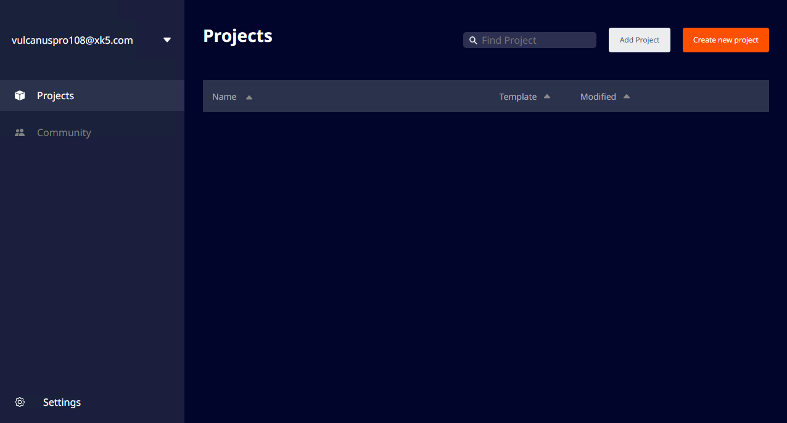
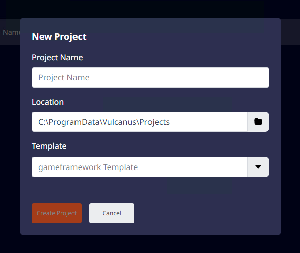

# 프로젝트 만들기

컴패니언 앱이 준비되면 프로젝트 창을 확인하실 수 있습니다.  
프로젝트 창에서 새 모드 프로젝트를 생성할 수 있습니다.  

 {width="900"}  

우측 상단의 'Create new project' 버튼을 클릭하면, 프로젝트 생성 팝업이 출력됩니다.  
 {width="400"}

1. 제작할 프로젝트의 이름을 입력하면, Create 버튼이 활성화 됩니다.
2. 프로젝트가 생성되는 위치를 확인하고, 사용할 템플릿을 선택합니다. 지금은 'gameframework Template'을 선택합니다.
3. 'Create' 버튼을 클릭하면 프로젝트가 생성되고 에디터가 실행됩니다.