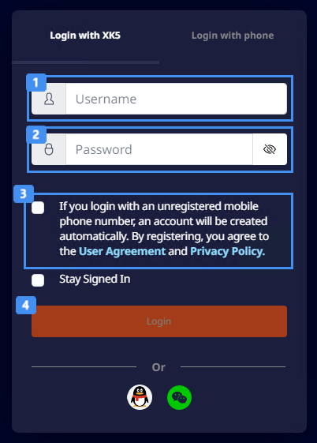

# 설치와 실행

불카누스 컴패니언 앱은 불카누스를 설치하고, 모드 프로젝트를 생성하고 관리할 수 있게 도와주는 첫 진입점입니다.  
제공된 설치 파일을 실행하면 불카누스 컴패니언 앱을 설치합니다. 설치가 완료되면 컴패니언 앱은 자동으로 실행되고 불카누스를 설치할 수 있습니다.  

 {width="900"}

## 컴패니언 앱 설치

설치 파일을 실행하면 자동으로 설치됩니다.  

## 로그인

불카누스는 xk5 계정으로 로그인해야만 사용할 수 있습니다. 컴패니언 앱이 실행되면 로그인할 수 있습니다.  
(현재는 XK5 계정 로그인만 가능합니다.)

### XK5 계정으로 로그인 하기

다음의 순서를 참고하여 XK5 계정으로 로그인합니다.

 {width="400"}

 '아이디@xk5.com' 입력  
 Password 입력  
 '이용 동의' 및   '개인 정보 약관'에 동의 체크  (체크 박스에 해당하는 내용은 임시입니다)  
 Login 버튼 클릭  
 Login 완료
  

#### 로그인 유지

불카누스 컴패니언 앱는 매번 로그인 할 필요 없이 로그인 상태를 유지할 수 있습니다.  
로그인 시에 'Stay Signed In' 항목에 체크하면 로그인이 유지됩니다.

> 동일한 계정으로 다른 PC에서 로그인하면 현재 로그인 된 PC의 계정은 로그아웃됩니다.  
> 불카누스 컴패니언 앱은 한 PC당 하나의 계정으로만 사용할 수 있습니다.  

## 불카누스 설치

불카누스를 실행하기 위해서는 Unity 에디터가 필요합니다.  
Unity Hub와 Unity Editor를 설치할 수 있는 가이드가 진행되고 설치를 완료할 수 있습니다.

### Unity Hub 설치

Unity Hub를 다운로드하고 설치합니다.

### Unity ID와 Unity 라이센스 활성화

Unity ID가 없다면, Unity ID를 생성하고 새 개인용 라이센스를 활성화합니다.  
기존에 Unity ID를 가지고 있다면 기존의 ID로 로그인하고 라이센스를 활성화 할 수 있습니다.

### Unity Editor 설치 및 확인

Unity Editor 2021.3.38f1 버전을 설치합니다.  
에디터 설치가 완료되면 컴패니언 앱에서 확인 버튼을 클릭합니다.  

## 불카누스 패키지 설치

불카누스 전용 패키지를 다운로드하고 설치합니다.  
다운로드 된 패키지는 불카누스에서 프로젝트를 생성할 때 자동으로 적용됩니다.  

설치 가이드를 모두 완료하시면 모드를 제작할 준비가 완료된 것입니다.