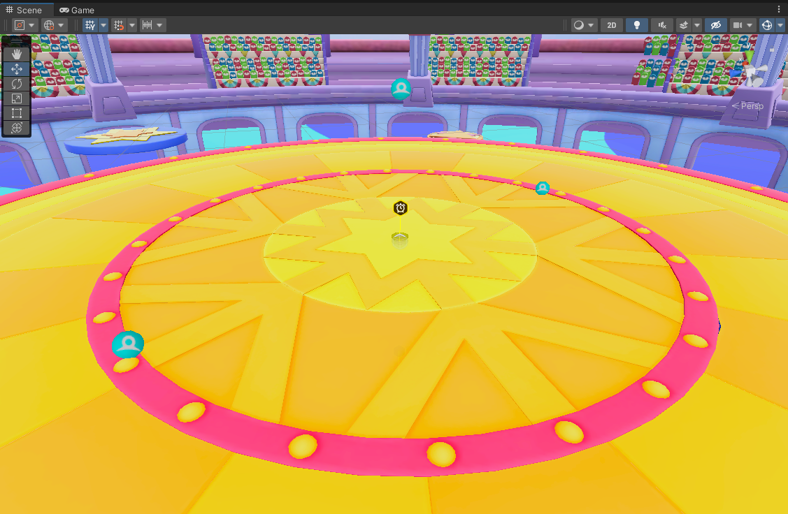

# 스테이지 생성

파티로얄 게임을 만들기 위해서는 게임 컨텐츠인 스테이지를 만들어야 합니다.

스테이지는 하나의 '파티로얄 게임 컨텐츠'를 말합니다.  
단판으로 진행되는 1라운드 게임으로 만들 수도 있고, 여러 라운드로 구성 된 큰 규모의 게임으로도 만들 수 있습니다.  

파티로얄 게임은 라운드 마다 스테이지 게임이 플레이되는 구조입니다.
라운드가 실행되면 라운드에 구성된 1개의 스테이지가 실행됩니다.

## 게임설정에서 스테이지 생성하기

스테이지 만들기는 '게임 설정'에서 할 수 있습니다.

 {width="900"}

 게임 설정에서 Stage 탭을 선택합니다.  
 템플릿에는 기본적으로 제공되는 Stage가 있습니다.  
- 해당 스테이지로 보다 쉽게 게임을 제작할 수도 있지만, 여기서는 스테이지를 만들어 제작하는 방법을 안내 합니다.  

 스테이지는 이름, 대표 이미지, 설명, Scene으로 구성되어 있습니다.  
 스테이지 구성 요소 중 Scene은 매우 중요합니다.  
- 게임 레벨과 장치 배치 등 실질적인 게임 제작이 Scene에서 이루어지기 때문입니다.
- 해당 Scene을 더블 클릭해 스테이지의 Scene을 작업 공간에 띄워 레벨을 만들어 보시기 바랍니다.
- 자세한 내용은 다음 가이드인 [레벨 디자인](Level-Design.md) 을 참고하세요.

 {width="900"}

 새로 만들기 버튼으로 나만의 스테이지를 생성할 수 있습니다.
- 템플릿에서 제공하는 스테이지를 선택해 완성된 게임을 변형할 수도 있으며, 텅빈 스테이지를 선택해 처음부터 레벨 디자인을 할 수도 있습니다.  

## 참고

- 
- 