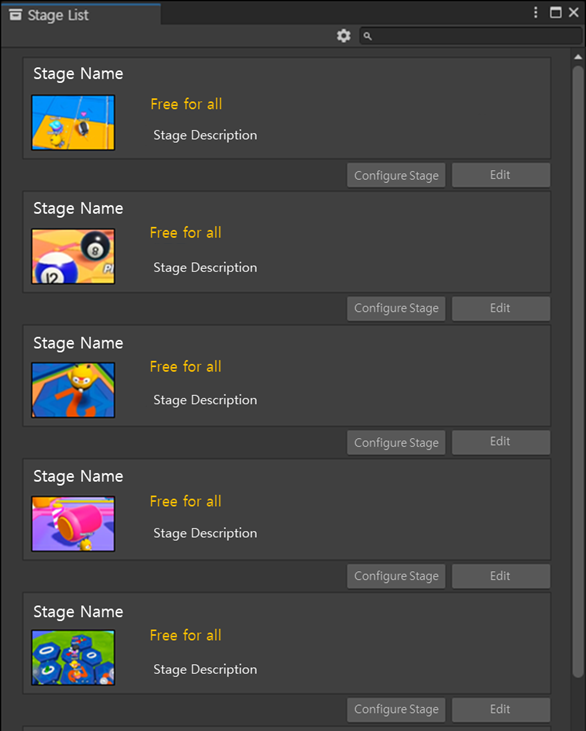
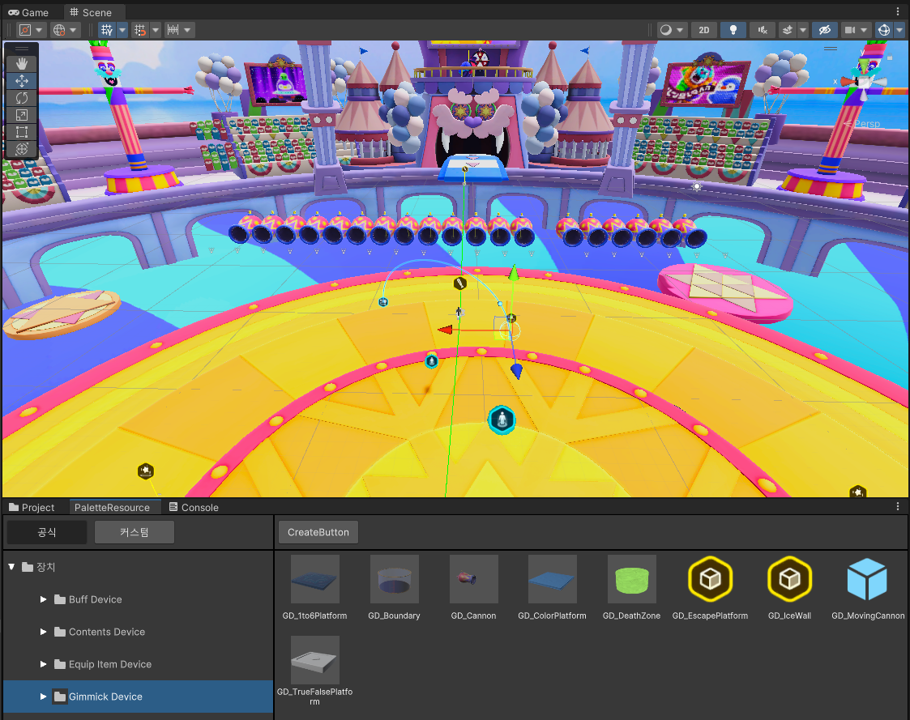

# 파티로얄 게임 제작하기 (초급)

해당 항목에서는 창작재료를 선택 또는 배치하고 수정하여 게임을 제작하는 방법을 안내합니다.  
본격적인 게임 제작에 앞서 불카누스 파티로얄 템플릿에서 제공하는 창작재료들에 대해 먼저 이해하면 이후 내용을 살펴보는데 도움이 될 것입니다.

## 파티로얄 게임 동작 Flow

파티로얄 템플릿에는 프로젝트만 생성해도 기본적인 파티게임이 플레이되도록, 기본 게임 동작 구조를 제공합니다.  

1. 파티로얄 템플릿 게임은 기본 4개의 라운드로 구성되어 있습니다.
2. 창작자가 게임을 제작하며 라운드 개수를 최소 1개로 줄일 수 있고, 더 추가할 수도 있습니다.
3. 자세한 내용은 게임 설정 매뉴얼을 참고 바랍니다.

## 창작 재료 사용

게임 제작에 사용할 수 있는 다양한 기능과 리소스들을 창작재료로 제공 합니다.
제공된 창작재료를 사용할 수도 있지만, 직접 창작자가 만들어 사용할 수도 있습니다.
아래 주요 창작 재료를 참고 바랍니다.

### 스테이지

파티로얄 게임에서 실제 동작하는 게임 컨텐츠 입니다.  
창작자가 스테이지를 직접 생성할 수도 있고, 라운드에 실행할 스테이지를 연결해 실행 순서를 변경할 수 있습니다.  
1개의 스테이지는 1개의 Scene으로 구성됩니다.  
스테이지 편집은 게임 설정에서 할 수 있습니다.

 {width="400"}

### 장치

장치는 특정한 기능을 가지는 불카누스 오브젝트입니다.  
각 스테이지에 포함된 Scene에 장치를 배치하고 옵션을 변경하여 나만의 게임을 창작할 수 있습니다.  
장치는 플레이어 캐릭터와 상호작용하거나, 다른 장치와 연결하여 게임을 구성하게 됩니다.  
장치는 불카누스 팔레트에 전시되며, 창작자가 직접 만들 수도 있습니다.  

 {width="400"}

### 게임 테스트

제작한 게임은 불카누스에서 즉시 테스트 플레이가 가능합니다.  
테스트 플레이를 통해 결과물을 확인하고 디버깅할 수 있습니다.  

자세한 내용은 아래 내용을 참고 바랍니다.

## 파티로얄 게임 제작 순서

<toc/>