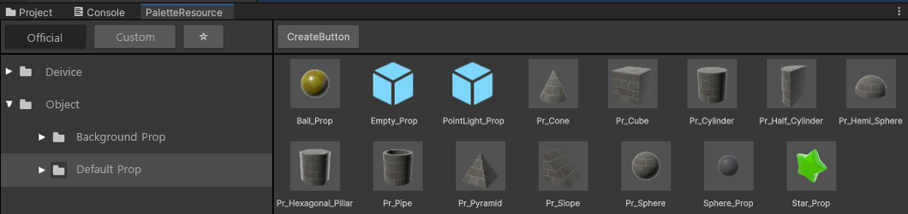
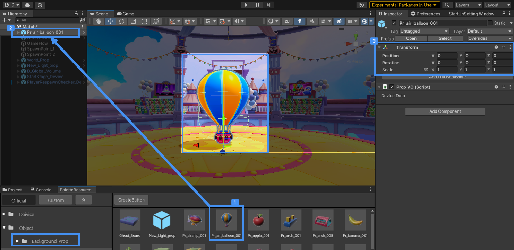
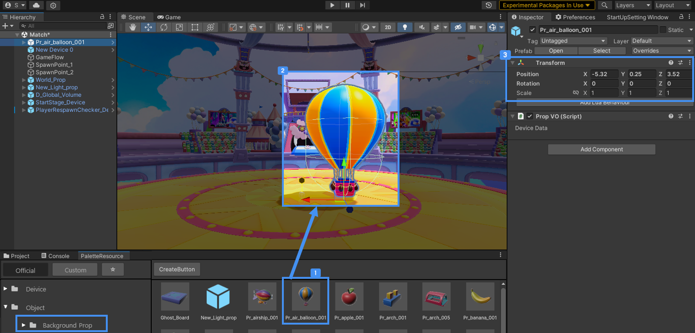
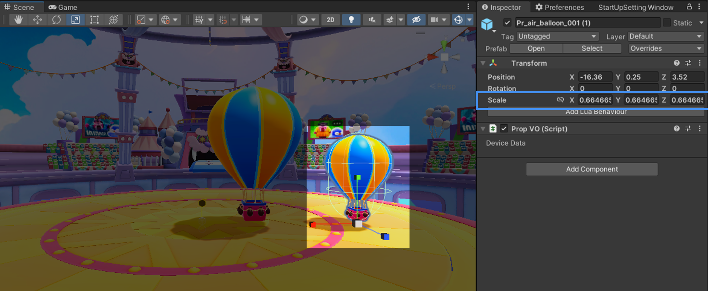
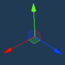
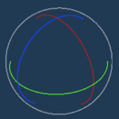
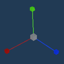
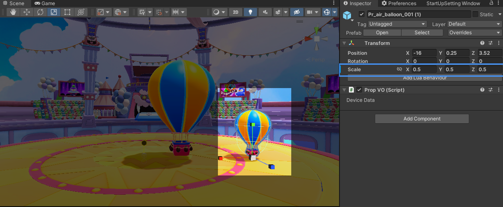

# 레벨 디자인

월드를 꾸밀 수 있는 프랍 오브젝트를 불카누스에서 기본 지원합니다.   
오브젝트와 장치를 배치하여 월드를 제작합니다.  

## 팔레트 윈도우에서 불카누스 장치와 불카누스 오브젝트 찾기   

 {width="900"}

PaletteResource 윈도우의 Official 탭에서 Device와 Object를 확인하실 수 있습니다.

## 월드에 오브젝트를 배치하기

월드에 오브젝트를 배치하는 방법은 'Hierarchy'나 'Scene'에 Drag&Drop하는 것입니다.

### Hierarchy에 추가하기

 {width="900"}

  Pr_air_balloon_001을 Hierarchy에 Drag&Drop 합니다.  
 Hierarchy에 프랍을 Drag&Drop하면 기본 Position 값(X,Y,Z=0,0,0)으로 자동 배치됩니다.  

### Scene에 직접 놓기

 {width="900"}

  Pr_air_balloon_001을 Scene에 Drag&Drop합니다.  
 Scene에 프랍을 Drag&Drop하면 원하는 위치에 배치 할 수 있습니다.   
   

## 월드에서 오브젝트 편집하기  

오브젝트는 월드에서의 위치 이동할 수 있으며 각도 회전, 크기를 변경 할 수 있습니다.   

### Scene

 {width="900"}

Gizmo를 마우스 클릭으로 자유로운 설정이 가능합니다.   
마우스 컨트롤에 따라 직관적인 설정을 할 수 있습니다.  
- Tool - Move / Rotate / Scale
- Tool Gizmo 제공

| 기능     | Gizmo 형태                                |
|:-------|:----------------------------------------|
| Move   |          |
| Rotate |        |
| Scale  |         |

1. 기구를 배치하여 Scale 버튼을 클릭하여 Gizmo를 변경합니다.  
2. 기구 오브젝트를 마우스 클릭한 상태에서 아래 방향 드래그했을 시 오브젝트 크기는 줄어듭니다. 
3. Inspector 확인 시 Scale값이 변동되며, 값은 매우 세밀한 값을 보입니다.

### Inspector

 {width="900"}

X/Y/Z 숫자를 입력하여 정확한 입력값을 입력하여 설계적인 설정을 할 수 있습니다.

| 기능       | 설명                   |
|----------|----------------------|
| Position | 오브젝트의 X,Y,Z 좌표 위치 이동 |
| Rotation | 오브젝트 각도 X,Y,Z 회전     |
| Scale    | 오브젝트 크기 X,Y,Z 변경     |