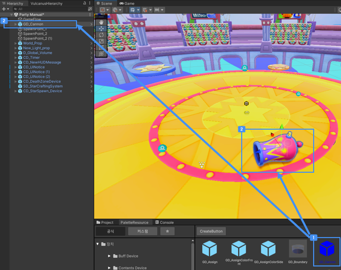

# 장치 배치

게임을 동작시키기 위해서는 필수로 필요한 장치가 있고, 장치의 개념을 학습하는 것이 필요합니다.  
가장 핵심적인 장치는 아래 주요 장치를 참고하세요.

## GameFlow 장치 설정

스테이지의 Scene이 로드되고 동작하면서 게임이 시작되고 끝나는 것은 모두 GameFlow 장치를 통해서 진행됩니다.
이에 GameFlow 장치 사용 방법을 학습하는 것이 중요합니다!

- 

Scene에 배치된 장치의 동작은 주로 GameFlow 장치의 Event Message를 통해 동작하면, 게임 흐름에 걸맞는 연출과 기능을 만들 수 있습니다.

- 

템플릿 창작재료로 제공된 스테이지의 Scene을 열고, 살펴보면 학습하는데 도움이 될 것입니다.

- 

## 장치 배치하기

 {width="900"}  

 팔레트를 사용하면 원하는 장치를 쉽게 찾아 배치할 수 있습니다.    
 팔레트에서 원하는 장치를 클릭합니다.  
Scene View 또는 Hierarchy에 드래그&드랍해 배치할 수 있습니다.  

또한 팔레트 내에 Custom 장치 만들기를 통해 만들고 싶은 장치가 있다면, 만들어 사용할 수도 있습니다.

## 참고
- 
- 