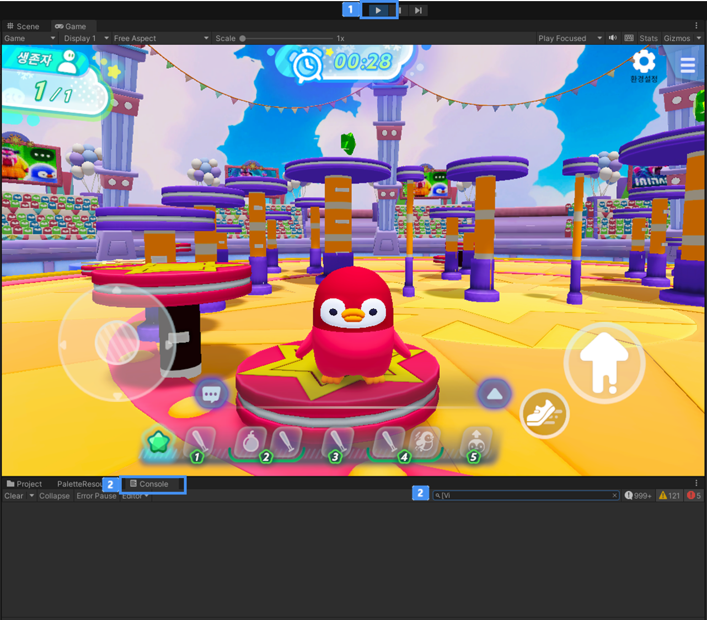

# 게임 플레이

불카누스에서는 제작한 게임을 손쉽게 플레이 해보며, 테스트를 할 수 있습니다.

 {width="900"}
  
 제작한 게임은 **테스트 플레이 버튼** 을 클릭하는 것만으로 손쉽게 플레이해 볼 수 있습니다.  
 플레이하면 Console창에 로그를 남겨 디버깅 용도로 사용을 할 수도 있습니다.

**Tip!** 불카누스 로그만 보기
- 검색창에 **'[Vi'** 를 입력하면, 비주얼 스크립트로 남긴 로그만 볼 수 있습니다.
- 비주얼 스크립트로 장치를 제작 시 **Instruction Action/Debug/Log** 를 활용해 보세요!