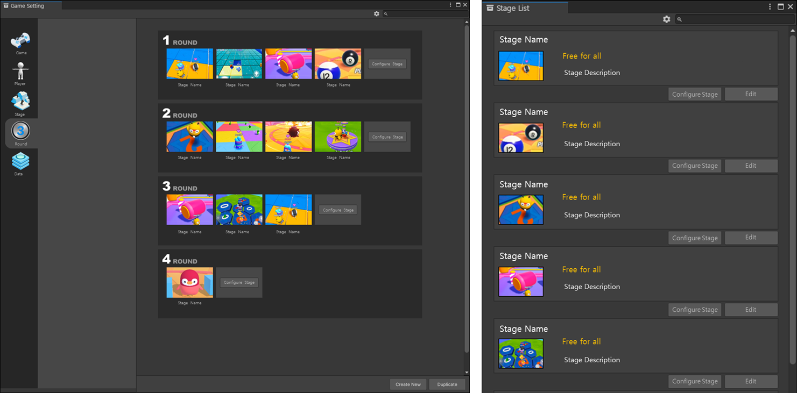

# 제작한 스테이지로 플레이를 하기 위한 게임 설정하기

파티로얄 템플릿 게임 진행 구조는 라운드 진행 방식입니다.
창작자가 게임을 제작하며 라운드 개수를 최소 1개로 줄일 수 있고, 더 추가할 수도 있습니다.
라운드가 진행될 때, 어떤 게임을 플레이할 지 창작자가 직접 설정할 수 있습니다.

## 게임 설정에서 라운드 설정하기

 {width="900"}  

라운드 설정에서는 라운드를 추가하거나 이미 만든 라운드를 삭제할 수 있습니다.
라운드에 제작한 스테이지를 삽입하는 것만으로도 손쉽게 게임을 동작 시킬 수 있습니다.

## 참고

- 