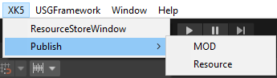

# 게임 출판

게임 제작이 완료되면 출판하여 ProjectB에서 플레이할 수 있습니다.  

XK5-Publish-MOD 메뉴를 클릭하여 출판할 수 있습니다.  

 {width="400"}

## 게임 심사와 게임 플레이

제작한 모드를 출판하기 위해서는 XK5에 심사 신청을 하게 됩니다.

XK5 운영자가 업로드된 모드를 검수한 후 심사 통과 결과를 여러분에게 통보합니다.  
여러분의 모드가 XK5 정책에 위반하지 않고 플레이하는 것에 문제가 없다면 심사가 완료되고, 개발자센터에서 완료 여부를 확인할 수 있습니다.  
심사가 통과된 모드는 ProjectB에서 플레이할 수 있습니다.

## 참고
- [게임 출판 매뉴얼](Publish-MOD.md)