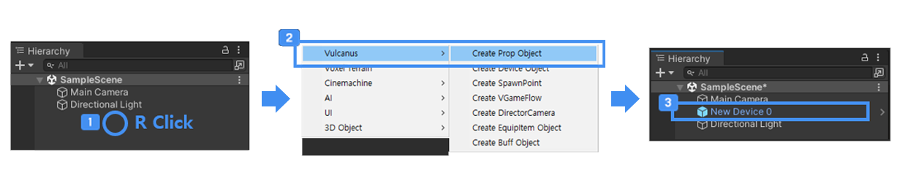
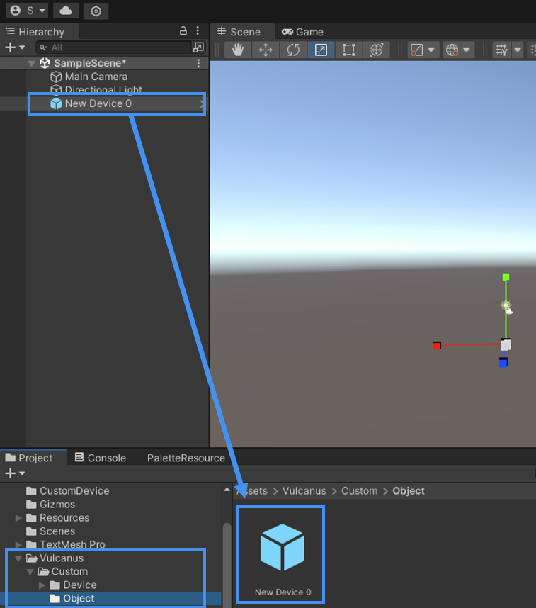
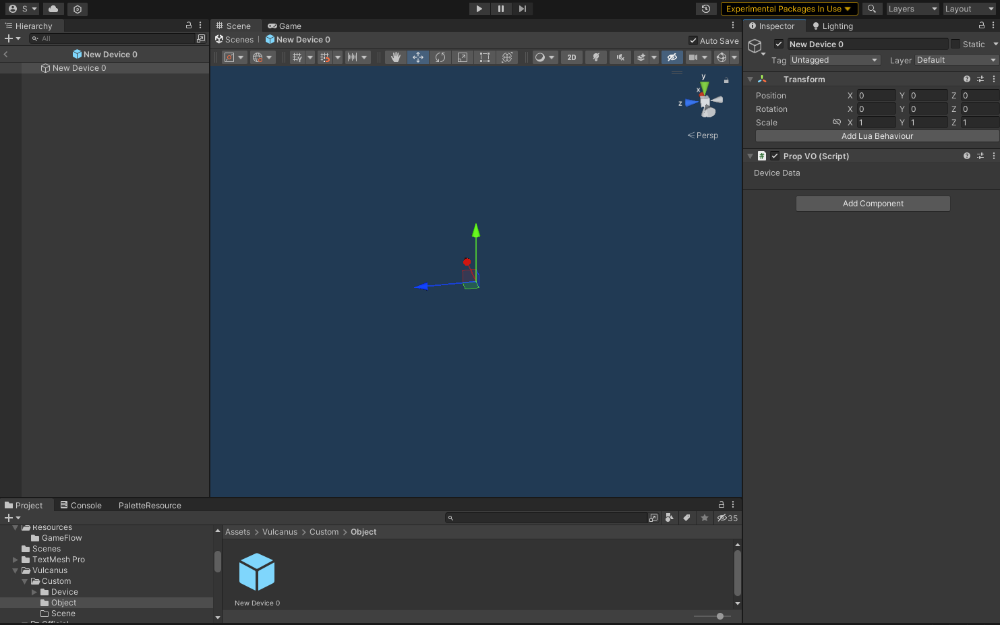

# 새 프랍 만들기
Raw 리소스만으로 Scene 월드를 제작할 수 없습니다.   
조립한 Raw 리소스를 담는 프랍 오브젝트를 만들어야 합니다.   
프랍 오브젝트 생성법과 팔레트 활용법을 설명합니다.  

## 비어있는 새 프랍 제작하기
1. Hierarchy에서 마우스 우클릭 합니다.
2. Vulcanus > Create Prop Object를 클릭합니다.
3. Hierarchy에 New Device 0 오브젝트가 생성됩니다.  

 {width="900"}

## 팔레트에 제작한 새 프랍 등록하기  
1. 생성한 New Device 0 오브젝트를 Custom 폴더내에 위치한 Object 폴더에 등록합니다.
2. New Device 0은 Prefab Asset으로 변환됩니다.  
 {width="400"}

## 팔레트에 등록한 새프랍 열기
2가지 방법으로 열 수 있습니다. 
- New Device 0을 Prefab Asset 더블 클릭하여 열기
- 한번 클릭 후 Inspector 상단에 위치한 Open 버튼을 클릭하여 열기  

### 새 프랍 오브젝트 오픈된 화면
 {width="900"}