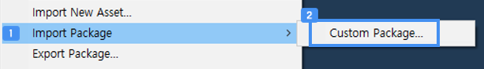
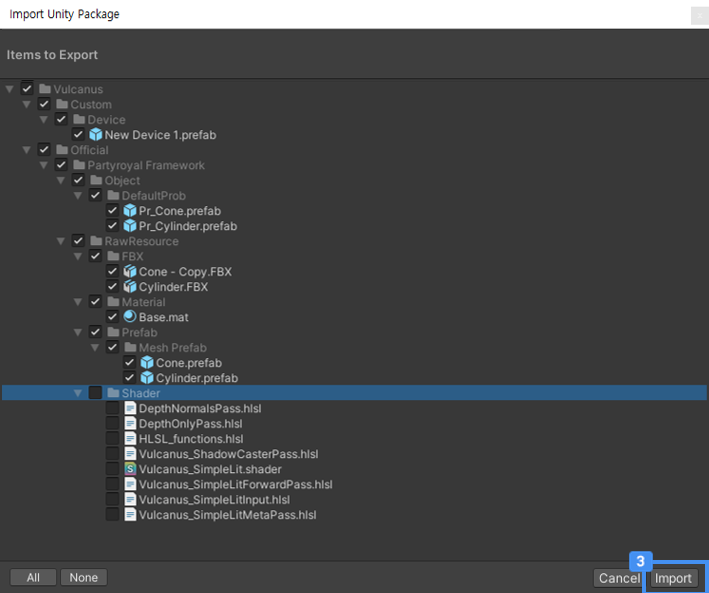
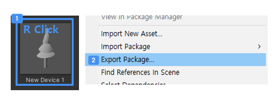
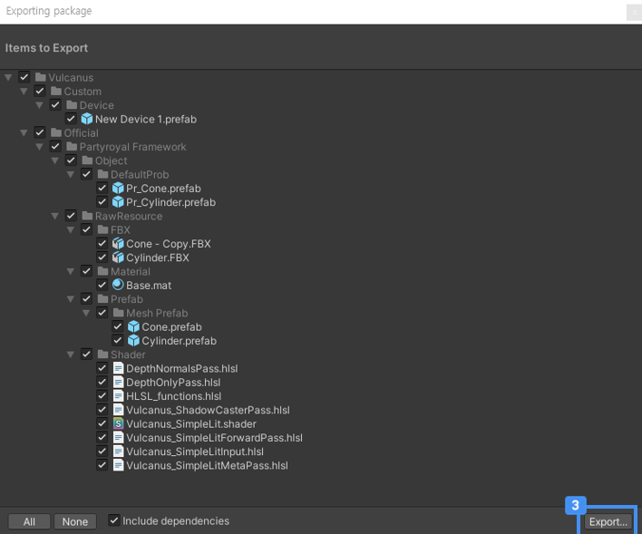

# 외부 리소스 활용하기
다른 사람이 만든 오브젝트, 창작자가 외부에서 제작한 Raw 리소스를 사용할 수 있습니다   
또한 다른 사람에게 내가 제작한 리소스를 공유하고 싶을 것 입니다.   
불카누스는 Asset을 내부 / 외부에서 관리하도록 기능을 지원합니다.

## Asset 기능   
프랍은 Asset 기능을 통해 내부 / 외부 파일로 관리됩니다.  

### Import New Asset    
로컬 외부 폴더에서 Raw 리소스 파일을 가져오는 기능입니다.     
  
Import 가능한 리소스 타입   
- 이미지 파일 : BMP,TIF,TGA,JPG,PNG,PSD 등   
- 3D 모델 파일 : FBX , OBJ 등   
- 애니메이션 (Mesh)  
- 오디오 파일

### Import Package
Export했던 패키지파일을 현재 오픈된 탬플릿으로 가져오는 기능입니다.  
오브젝트 제작에 조립한 구조를 지키면서 사용한 Raw 리소스를 다량 가져오는 기능입니다.   
필요한 리소스를 선택하여 받을 수 있습니다.

  
Assets > Import Package > Custom Package 를 선택합니다.  
외부에서 패키지를 찾을 수 있도록 윈도우를 오픈합니다.  
파일 브라우저에서 임포트할 파일을 선택하고 Import 버튼을 클릭합니다.
- Import 예정 파일은 체크박스가 체크된 상태로 기본 보여집니다.  
- Import 제외되는 파일은 자동 체크박스가 해제된 상태로 기본 보여지며, 체크 세팅은 되지 않습니다.   
- 체크가 되지 않은 항목은 이미 내 불카누스 프로젝트에 존재하는 리소스 입니다.

### Export Package  
불카누스에서 조립 제작한 프랍 리소스가 조립이 해제되지 않도록 구조를 지킵니다.   
재료로 사용된 리소스의 폴더 구조를 지킵니다.   
프랍 리소스 내부에 조립한 Raw 리소스를 정리하여 포함합니다.   
프랍 리소스는 불카누스 고유 리소스이므로 외부에서 열 수 없습니다.   
외부에서 관리하기 위한 Package파일로 저장됩니다.  

  
프랍 선택 상태에서 우클릭합니다. 또는 리본 메뉴 Asset을 클릭합니다.  
Export Package를 선택합니다.  
Export 윈도우가 생성되고 선택했던 프랍 오브젝트 정보를 보여줍니다.
목록을 확인하고 저장할 정보를 체크하고 Export 버튼을 클릭합니다
  
외부 폴더로 저장하기 위한 윈도우가 뜹니다. 
이름을 지정하고 외부 폴더에 저장버튼을 클릭합니다.   
폴더에 Package가 생성됩니다.  

