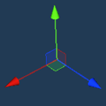

#  제공된 리소스 활용하기  
불카누스에서 게임프레임워크에 따라 리소스를 제공합니다.   
리소스를 활용하여 프랍을 만들 수 있습니다.

## 기본 도형 활용하기
불카누스에서 기본으로 제공하는 10가지 형태 도형 오브젝트입니다.  
10가지 도형을 활용 조립하여 여러 가지 형태를 만들 수 있습니다.  
 {width="400"}

### 도형 프랍 오브젝트 팔레트 위치  
- 공식 > 기본 오브젝트
 {width="900"}

## 새 프랍에 기본 도형 세팅하기  
팔레트에서 도형을 선택 클릭한 상태에서 Hierarchy로 드래그 & 드랍합니다.    
 {width="900"}

Hierarchy에 선택한 기본 도형이 추가되며, Scene에서 형태를 확인 할 수 있습니다.  
 {width="900"}  
  
## 새 프랍에서 기본 도형 편집하기
1. 도형의 위치 이동,각도 회전 , 크기 변경 할 수 있습니다.
{width="900"}

Scene   
  
Gizmo를 마우스 클릭하여 자유로운 설정이 가능합니다.
마우스 컨트롤에 따라 직관적인 설정을 할 수 있습니다.  

- Tool - Move / Rotate / Scale 
- Tool Gizmo 제공

|   기능   |                                     Gizmo 형태                                     |
|:------:|:--------------------------------------------------------------------------------:|
|  Move  |      |
| Rotate |  |
| Scale  |    |

  
 Inspector  
  
X/Y/Z 숫자를 입력하여 정확한 입력값을 입력하여 설계적인 설정을 할 수 있습니다.  
{width="400"}

| 기능       | 설명                   |
|----------|----------------------|
| Position | 오브젝트의 X,Y,Z 좌표 위치 이동 |
| Rotation | 오브젝트 각도 X,Y,Z 회전     |
| Scale    | 오브젝트 크기 X,Y,Z 변경     |
  

도형의 질감을 설정합니다. 
- 색상 , 표면 매끄러움 정도 , 표면 형태 (Texture)
Inspector의 옵션을 변경하여 다양한 질감 제작이 가능합니다.

## 불카누스 리소스 활용하기
게임프레임워크에서 테마에 따라 많은 Raw 리소스를 지원합니다.  
Raw 리소스는 가장 기본적인 재료 리소스입니다.  
게임 오브젝트로 제작하는데 활용성 높으나, 단일 사용에는 제한적입니다.  
프랍 오브젝트에서 Raw 리소스를 조립하여 다양한 형태 오브젝트를 제작해보세요.
 {width="600"}

### Raw 리소스 폴더 경로
Vulcanus > Official > Partyroyal Framework > RawResource  
 {width="600"}
## Mesh 프랍 제작하기   
 {width="900"}  

 폴더 RawResource > FBX에서 "PartyBG_BalloonDancer"을 선택합니다   
Hierarchy에 드래그 & 드랍합니다.   
Scene에 PartyBG_BalloonDancer Mesh가 생성됩니다.  
 {width="900"}

폴더 RawResource > Material에서 "PartyBG_BalloonDancer"를 선택하여 PartyBG_BalloonDancer Mesh에 드래그 & 드랍합니다.

Tip) Material은 다른 Mesh에서도 적용하여 사용할 수 있습니다.   
Material을 변경하면 다른 Mesh도 변경된 사항이 적용됩니다.   
선택한 Material을 복제 사용하면 다른 리소스에 영향을 주지 않게 방지할 수 있습니다.

 {width="900"}
PartyBG_BalloonDancer Mesh를 선택 중 상태의 Inspector에서 Material이 적용된 것을 확인할 수 있습니다.  

 {width="900"}    

Material의 Tab을 펼쳐서 Color를 활용하여 색을 변경합니다.  
 {width="900"}  
  
Hierarchy에서 가장 상위 계층 오브젝트를 선택하고 이름을 변경합니다.   
Hierarchy < 버튼을 클릭하여 프랍 오브젝트를 나갑니다.  
  
  
 팔레트 리소스에서 제작한 프랍 오브젝트를 확인할 수 있습니다.  

- 프랍을 팔레트 목록 추가 방법은 새프랍 만들기를 참고해주세요

 
