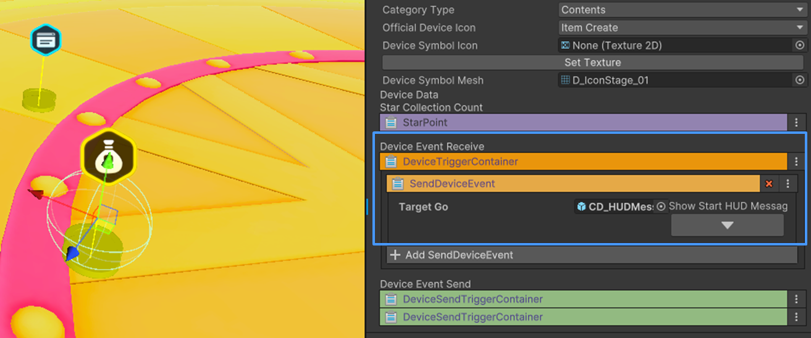
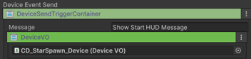
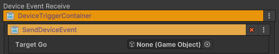
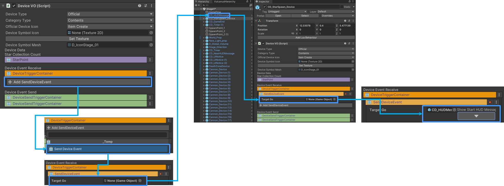
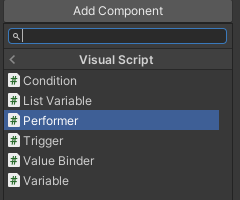
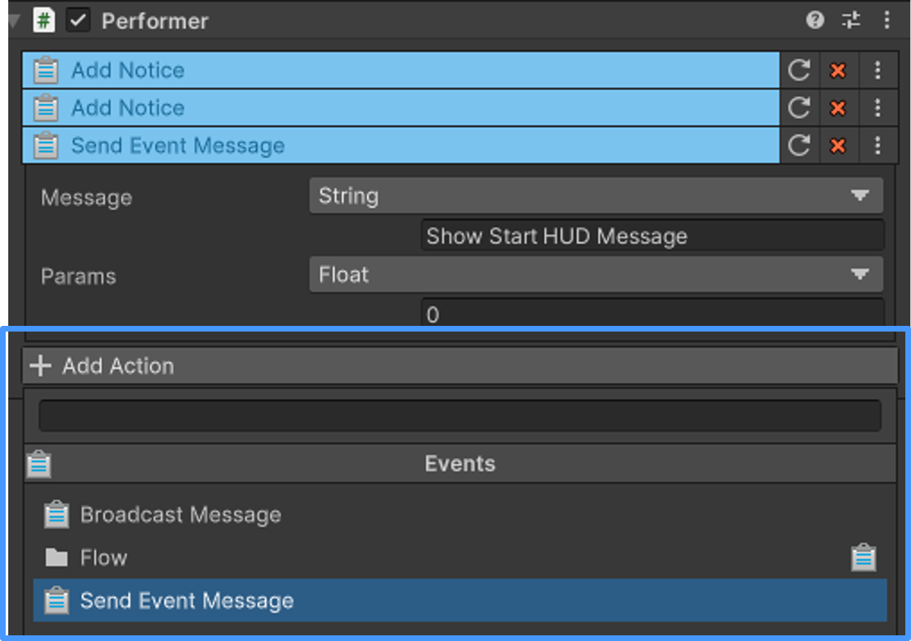
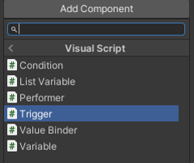
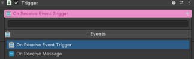

# 장치 간 이벤트 연결하기

## 장치와 장치 연결하기

불카누스 에디터로 게임을 제작하기 위해서는 장치를 사용해야 하며, 장치를 서로 연결하여 게임을 제작할 수 있습니다.  
장치의 기능을 동작 시키기 위한 가장 쉬운 방법은 Scene에 배치된 장치와 장치를 연결하는 것입니다. 

{width="900"}
> 연결 방법
> - 연결할 장치를 Scene에 배치합니다.
> - 연결할 장치에 아래의 기능이 있는지 확인합니다
>   - 보내는 장치에 Device Event Send가 있는지 확인합니다
>   {width="400"}
>   - 이벤트를 받는 장치에 Device Event Receive가 있는지 확인합니다
>   {width="400"}

## 장치 연결하기

1. 이벤트를 연결할 장치의 **Device Event Receive**에서 **Add Send Device Event**를 클릭합니다
2. **Taget Go**의 컴퍼넌트에 이벤트를 받을 장치를 연결합니다
3. 이벤트를 가져올 장치를 연결하고 버튼을 통해 트리거를 받을 이벤트를 결정합니다.
   - 예시) HUD Message 장치가 작동 했을 때, 별 크래프트 스폰 장치를 작동 예시
   {width="900"}

### 장치에 Send Message 항목이 없을 경우

1. 장치에 이벤트 연결 Data가 없다면, 장치 내부에 진입하여 Visual Script를 사용해야 합니다.
   > 설정 방식
   >  - **Add Component > Visual Script > Perfomer를 추가**합니다.
   > {width="400"}
   >  - 추가한 **Perfomer Component**에서 **add Action > Events > Send Event Message**를 추가합니다
 {width="400"}

        
### 장치에 이벤트를 받을 트리거이 없을 경우

1. 장치에 Send Event를 받을 Data가 없다면, 장치 내부에 진입하여 Visual Script를 사용해야 합니다.
> 설정 방식
>  - **Add Component > Visual Script > Trigger를 추가**합니다.
     > {width="400"}
>  - 추가한 **Trigger Component**에서 **add Action > Events > Send Event Message**를 추가합니다
 {width="400"}

## 참고

- 장치 제작 방식에 대한 매뉴얼은 하단 내용을 참고하세요
  - [장치 시스템](Devices.md)
  - [컨텐츠 장치 만들기](Contents-Device.md)
  - [기믹 장치 만들기](Gimmick.md) 
  - [아이템](Equipitem-Item-System.md)
  - [Visual Script](Visual-Scripting.md)
  - [Instruction](Instruction.md)