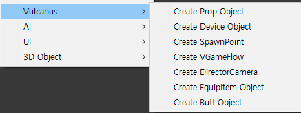

# 기믹 아이템장치 만들기

## 기믹 아이템이란

기믹 아이템은 일반적으로 생성 장치나 발사 장치 등의 아이템으로 등록되어 씬에 동적으로 생성되는 사용성을 가진 장치를 의미합니다.
>현재는 기믹과 기믹 아이템이 사용성의 차이를 가질 뿐 동일하며, 추후 각각의 특성에 맞는 디폴트 컴퍼넌트가 추가 될 예정입니다.
{style='note'}

## 새 장치 만들기

1. 하이어라키의 **Context Mane>Vulcanus** 항목을 이용하여 장치를 생성.(이후 팔레트에서 에셋 형태로 생성 지원 예정 )
2. 하이어라키에 생성된 **New Device**를 **프로젝트 윈도우** 의 커스텀 장치 경로로 드래그 하여 프리펩을 생성합니다.
   생성된 장치는 **팔레트>커스텀 장치** 에서 확인 할 수 있습니다. Assets\Vulcanus\Custom\Device\GimmickDevice
3. 하이어라키에서 프리펩 편진모드로 진입하여 장치를 제작합니다.
4. 장치 하위에 사용할 렌더링 오브젝트나 프랍을 배치합니다.
5. 인스펙터에 제공되는 비주얼 스크립트 도구를 이용 해 기능을 디자인 합니다.

## 기믹 장치 세팅하기

기믹 아이템 장치 제작 시 아래의 내용을 참고 해주세요.
- 기믹 아이템을 씬에 동적으로 생성 할 경우, 잔여 기믹 아이템이 씬에 보이지 않더라도 반드시 Destroy 해주어야 합니다. 
(비주얼 스크립트의 Dedtroy는 동적으로 생성된 대상에 대해서만 동작합니다. 편집 씬에서 미리 배치한 오브젝트에는 동작하지 않습니다.)

## 참고

- [컨텐츠 장치 만들기](How-To-Create-Contents-Device.md) 