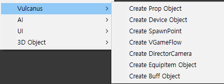

# 기믹 장치 만들기

사용자는 기믹 장치를 생성할 수 있습니다. 존재하는 기믹 장치를 커스텀 장치로 복제하여 편집하거나 아예 비어있는 장치를 생성하여 내부를 디자인 할 수도 있습니다.  
>기믹 장치는 랜더링 되는 자신의 오브젝트를 가지고 있기 때문에 추후 자동으로 표시되는 장치 기즈모를 지원하지 않도록 개발예정입니다.
장치 만들기 기능은 개발 중인 현재 에디터의 상태를 반영하여 에디터의 개발 상황에 반영한 가이드 문서가 제공됨을 참고해주세요  
{style='note'}
 

## 새 장치 만들기

1. 하이어라키의 **Context Mane>Vulcanus** 항목을 이용하여 장치를 생성.(이후 팔레트에서 에셋 형태로 생성 지원 예정 )
2. 하이어라키에 생성된 **New Device**를 **프로젝트 윈도우** 의 커스텀 장치 경로로 드래그 하여 프리펩을 생성합니다.
  생성된 장치는 **팔레트>커스텀 장치** 에서 확인 할 수 있습니다. Assets\Vulcanus\Custom\Device\GimmickDevice 
3. 하이어라키에서 프리펩 편진모드로 진입하여 장치를 제작합니다. 
4. 장치 하위에 사용할 렌더링 오브젝트나 프랍을 배치합니다.
5. 인스펙터에 제공되는 비주얼 스크립트 도구를 이용 해 기능을 디자인 합니다.

## 기믹 장치 세팅하기

장치 제작 시 아래의 내용을 참고 해주세요.
- 기믹 장치 제작에 사용 되는 일부 비주얼 스크립트 기능은 Unity의 **Collider** 나 **Rigidbody** 컴퍼넌트를 필요로 합니다. 
- **On Collision Enter** 와 같은 일부 물리 트리거는 **Collider** 를 가진 오브젝트를 대상에 직접 스크립트를 추가해야만 정상 동작합니다.
- 장치 사용씬에서 보았을 때 장치 하위의 장치나 프랍은 불카누스 하이어라키에 표시되나 유니티 오브젝트로 제작한 내용은 확인할 수 없습니다.
기믹의 특성과 동작을 고려하여 재료의 성격을 잘 설정 해주세요.

## 참고

- [컨텐츠 장치 만들기](How-To-Create-Contents-Device.md)