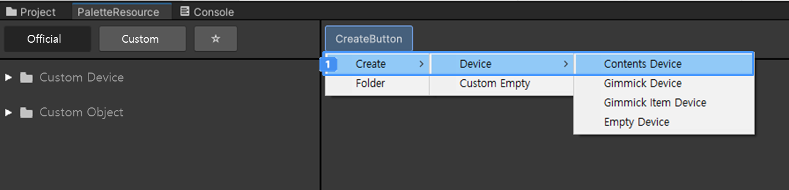
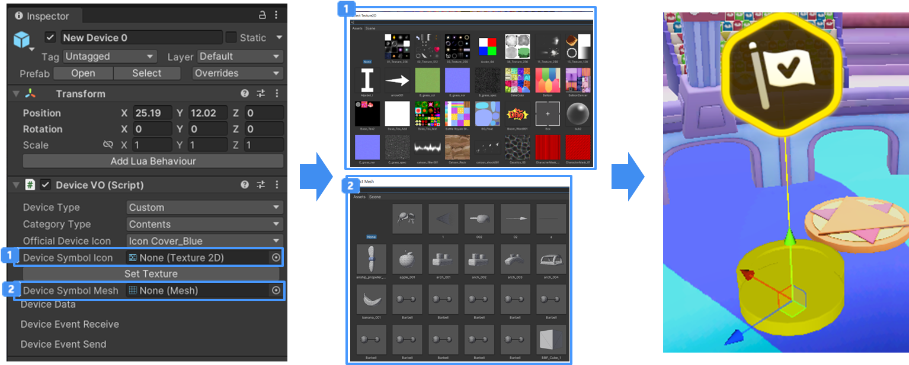

# 컨텐츠 장치 만들기

사용자는 팔레트를 이용하여 새로운 장치를 만들 수 있습니다.  
게임에 표시되지 않고, 기즈모로 제공할 장치를 제작할 때 컨텐츠 장치를 통해 제작할 수 있습니다.  
아래의 내용을 통해 새로운 장치를 제작에 방식을 설명합니다.  

## 새 장치 만들기

1. 팔레트의 **Create Button**을 클릭
2. 컨텍스트 메뉴의 **Create > Device > Contents Device** 메뉴 클릭
3. 새롭게 제작된 장치는 **New Device** 이름을 가지고 장치가 추가됩니다.
4. 제작된 장치는 아래의 위치에서 확인할 수 있습니다.
    - Hierarchy
    - 팔레트 위치 : 커스텀 Tab > 장치 폴더
      

## 장치 세팅하기

1. 컨텐츠 장치를 제작한 유저는 장치를 다음과 같이 꾸밀 수 있습니다.
   - 기즈모를 이용하여 컨텐츠 장치 제작하기
    
   - 컨텐츠 장치를 오브젝트로 사용하기
     > 컨텐츠 장치를 오브젝트로 사용하는 방식은 기믹 장치와 동일합니다.  
     > 기믹 장치 제작 방식은 기믹 장치 제작 가이드를 참조하십시오
     {style='note'}

## 참고

- [기믹 장치 만들기](Gimmick.md) 