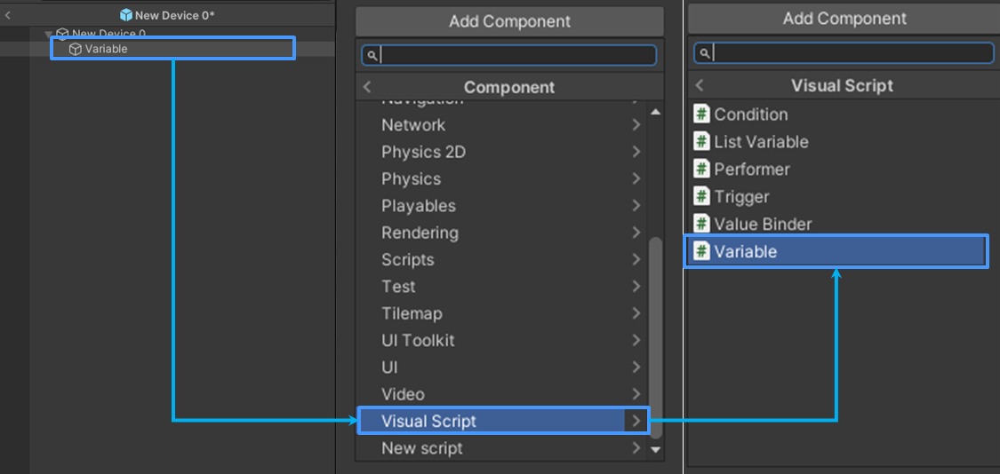
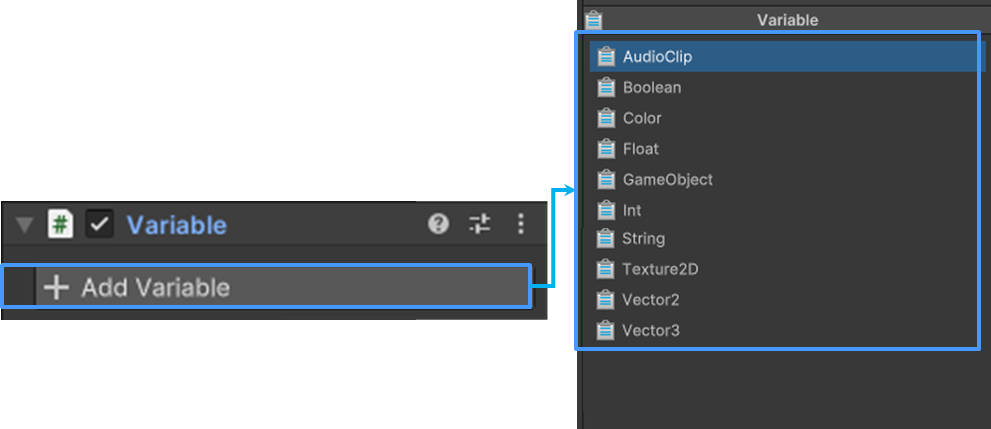

# 장치 변수 설정
## 변수

변수는 데이터를 저장하고, 다른 장치와 연결하여 값을 전달하거나 조작할 수 있는 데이터 컨테이너를 의미합니다.  
도구(Visual Script)에서 변수는 "흐름 제어, 상태 추적, 계산 및 데이터 전달"을 수행하는 중요한 기능입니다.

### 비주얼 스크립트와 변수의 관계

  1. **동적 게임 플레이 구현:** 장치를 통해 생성된 변수는 게임 플레이 중에 실시간으로 값을 변경할 수 있습니다. 예를 들어, 장애물의 속도, 아이템 값을 변경할 수 있습니다.
  2. **조건부 이벤트:** 특정 조건이 충족되었을 때 변수를 기반으로 이벤트를 발생시킬 수 있습니다. 예를 들어, 지정된 변수 값이 임계값에 도달했을 때 이벤트를 실행할 수 있습니다.
  3. **유연한 게임 디자인:** 변수를 통해 게임의 복잡한 논리를 쉽게 구현할 수 있으며, 이는 다양한 게임 시나리오와 맞춤형 경험을 제공하는 데 도움이 됩니다.  

### 장치와 변수의 관계

장치는 게임 내에서 다양한 기능을 제공하는 게임 오브젝트이며, 변수를 저장할 수 있는 데이터 컨테이너 역할을 합니다.  
사용자는 장치와 변수를 이용하여 동적으로 관리하고, 복잡한 게임 로직을 구현할 수 있습니다. 또한, 변수를 장치 Inspector에 표시하는 기능을 설정할 수 있으며, 장치를 공유받는 다른 사용자는 간단히 값을 변경하여 장치를 설정할 수 있습니다.

## 변수 생성하기

변수는 도구 편집 환경에서 만들 수 있습니다.

### 설정 메뉴

Add Component > Visual Script > Variable  

### 구성 방식

#### 생성

 {width="900"}

도구 인스펙터에서 이미지에 표시된 순서로 변수를 생성할 수 있습니다.

#### 변수 추가

{width="900"}

변수를 생성하면 사용자는 Add Variable 명령어를 통해 원하는 Variable Data를 추가할 수 있습니다.

## 참고

불카누스에서 제공되는 변수 리스트는 매뉴얼을 참고하세요.

- [변수 매뉴얼](Variable.md)