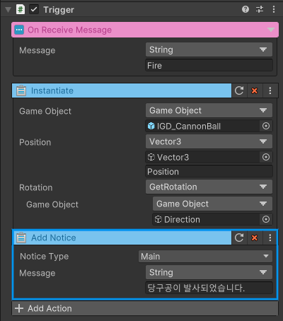

# UI 장치

## Vulcanus 의 UI 제공 방향

Vulcanus는 사용자의 편의와 에디터의 안정성을 고려하여 UI 사용의 자유도를 제한하는 대신 높은 수준의 편의를 제공하고 있습니다.  
모든 UI는 제공되고 UI 프리펩을 직접 편집할 수 없으며, 비주얼 스크립트를 통해 특정한 UI의 특정한 정보를 변조할 수 있는 기능을 구체적인 지원하고 있습니다.  
각 UI에 따라 변조할 수 있는 옵션이 다르며, 출력 시점 이외에 설정 할 수 있는 옵션이 없는 UI도 존재 합니다.

## 새 장치 만들기

1. UI장치는 컨텐츠 장치의 일부로 생성 프로세스가 동일합니다.

## UI 장치 세팅하기

장치 사용자는 공식 장치로 제공되고 있는 UI 장치를 이용 하여 원하는 시점에 UI를 출력 할 수 있습니다.  
만약 사용자가 Vulcanus의 비주얼 스크립트를 사용 한다면 제작하고 있는 장치에 UI를 출력할 수 있는 Instruction을 직접 추가하는 방식으로 원하는 상황에 UI를 출력할 수도 있습니다.
 {width="400"}

# 참고

- [컨텐츠 장치 만들기](How-To-Create-Contents-Device.md) 